# 谷雨（guyu）系统架构与模块功能

> **项目来源**：太平洋保险 paic「谷雨」AI 知识库 + IM + 业务系统微服务套件
> **代码位置**：`/root/workspace/guyu/`（解压自 `guyu.rar`，55MB）
> **代码规模**：5,056 个文件，~46.7 万行（Python 2.7万 + 前端 43.9万 + Java + 配置）
> **核心定位**：太平洋保险内部 AI 知识管理 + 即时通讯 + 客服/坐席一体化平台

---

## 🎯 一句话架构总览

**谷雨 = 「统一网关 gateway」+ 「知识库 Python 中台 guyu_python」+ 「6 个知识库 Java 微服务 knowledge」+ 「IM 即时通讯套件」+ 「3 个 Vue 前端」+ 「MySQL/Redis/Nacos/Milvus/ES/Kafka 等基础设施」**

---

## 🏛️ 二、整体架构图（Mermaid）

```mermaid
flowchart TB
    %% ============ 用户层 ============
    subgraph USERS["👥 用户层"]
        U_AGENT["坐席/客服<br/>(PC Web)"]
        U_MGR["业务管理员<br/>(知识库运营)"]
        U_ADMIN["系统管理员<br/>(csp-ai-admin)"]
        U_MOBILE["客户<br/>(公众号/H5)"]
    end

    %% ============ 前端层 ============
    subgraph FRONTEND["🎨 前端层 (Vue)"]
        FE_ADMIN["admin_web<br/>后台管理<br/>1972 文件 / Vue 3 + Vite<br/>路由: knowledge / robot / console"]
        FE_SERV["serv_web<br/>业务前端 (坐席)<br/>505 文件 / Vue 2 + ElementUI<br/>路由: serviceChat / 工单 / 评价"]
        FE_IM_WEB["im/im-client<br/>IM Web 端<br/>坐席 IM 工作台"]
        FE_IM_H5["im/im-platform (含 H5)<br/>IM 公众号/H5"]
    end

    %% ============ 网关层 ============
    subgraph GATEWAY["🌐 网关层"]
        GW["gateway (Spring Cloud Gateway)<br/>端口 8060<br/>路由前缀: /cspaicser/<br/>• JWT 鉴权 (SecurityTokenGlobalFilter)<br/>• 白名单机制 (urls / urlPrefixes)<br/>• Redis session 共享<br/>• 通过 Nacos 服务发现 lb://"]
    end

    %% ============ 业务服务层（Java 微服务）============
    subgraph JAVA_MS["☕ Java 微服务层 (Spring Boot)"]
        MS_ADMIN["csp-ai-admin<br/>端口 8079, context-path: /admin-server<br/>聚合入口 (Feign)<br/>集成 6 个 knowledge 子项目"]
        MS_IM_PLAT["im/im-platform<br/>IM 平台服务<br/>群/消息/权限/SSO"]
        MS_IM_SVR["im/im-server<br/>IM WebSocket 服务<br/>lb:ws://im-websocket-server"]
        MS_KB_CFG["kb-config<br/>端口 8085, context-path: /kb-config<br/>知识库核心服务"]
        MS_KB_BANK["knowledge/knowledge-bank<br/>知识库业务"]
        MS_ROBOT["knowledge/robot-workbench<br/>机器人工作台"]
        MS_CONSOLE["knowledge/management-console<br/>管理控制台"]
        MS_AUDIT["knowledge/interface-audit<br/>接口审计"]
        MS_KSP_BE["ksp-backend<br/>端口 8091"]
        MS_KSP_KG["ksp-kg<br/>端口 8095, context-path: /ksp-kg<br/>知识图谱"]
        MS_AGENT_OPS["agent-ops<br/>端口 8082, context-path: /agent-ops<br/>Agent 运营平台"]
        MS_MODEL["model/zhishiku<br/>模型服务"]
    end

    %% ============ AI 核心层（Python 中台）============
    subgraph PYTHON["🐍 AI 核心中台 (Python / Flask)"]
        PY_APP["guyu_python/zhishiku/app.py<br/>端口 8667, Flask + gevent<br/>统一注册 Blueprint<br/>• 鉴权: 转发 im-platform/feign/authValid<br/>• APScheduler 定时: 向量化热度/案例<br/>• Cyberark 取 mysql 密码"]

        subgraph PY_CTRL["controllers/ (15 个 controller)"]
            C_CHATGLM["chatglm_server.py<br/>ChatGLM3-6B 推理"]
            C_DEEPSEEK["deepseek_server.py<br/>DeepSeek 推理"]
            C_PAGPT["pagpt_server.py<br/>平安自研 PA-GPT"]
            C_EMBED["embedding_server.py<br/>m3e-base 向量化<br/>(sentence-transformers + CUDA)"]
            C_KNOW["knowledge_server.py<br/>QA 创建/向量化调度"]
            C_FLOW["flow_server.py<br/>LangGraph 工作流编排"]
            C_AGENT["agent_server.py<br/>Agent 工具调用<br/>(LangChain AgentExecutor)"]
            C_RANK["rank_server.py<br/>重排序"]
            C_DOC["doc_convert.py<br/>文档转换"]
            C_SPLIT["document_splitter_server.py<br/>文档切片"]
            C_MILVUS["milvus_server.py<br/>Milvus 向量库"]
            C_CLA["classification.py<br/>意图分类"]
        end

        subgraph PY_LLM["llm/ (LLM 工厂)"]
            L_FAC["llmFactory.py / chatGlmFactory.py<br/>DeepSeekFactory / DeepSeekLocalFactory<br/>glmFactory / glmFactoryForCall"]
        end

        subgraph PY_AGENT["Agent/"]
            A_BASE["base.py → AgentBuilder<br/>LangChain Agent 框架"]
        end

        subgraph PY_TOOLS["tools/"]
            T_API["APITool.py (HTTP 工具)"]
            T_KNOW["KnowledgeTool.py (Milvus/ES 检索)"]
        end
    end

    %% ============ 基础设施层 ============
    subgraph INFRA["🛢️ 基础设施层"]
        DB_MYSQL["MySQL 5.7<br/>appdata 库<br/>(用户/知识/IM)"]
        DB_REDIS["Redis 7<br/>(session/缓存/限流)<br/>database 1/10 多库"]
        DB_NACOS["Nacos 2.3.2<br/>(配置中心 + 服务发现)<br/>30.171.83.232:8848"]
        DB_MILVUS["Milvus<br/>(向量数据库)"]
        DB_ES["Elasticsearch 7.17<br/>(全文检索)"]
        DB_KAFKA["Kafka<br/>topic: kfk-topic"]
        DB_MQS["MQS (太平洋 MQS 消息队列)"]
        DB_IOBS["iobs 对象存储<br/>(太保内部 S3)"]
        DB_ZK["ZooKeeper<br/>(分布式协调)"]
        DB_ETCD["etcd (Milvus 元数据)"]
        DB_MINIO["MinIO (替代 iobs 测试用)"]
    end

    %% ============ 外部系统 ============
    subgraph EXT["🌍 外部系统 (太保内部)"]
        EX_PACAS["PACAS<br/>(统一认证)"]
        EX_CYBERARK["Cyberark<br/>(密码保险箱)"]
        EX_CSP["CSP Open API<br/>(大模型/翻译)"]
        EX_ESG["ESG<br/>(消息推送)"]
        EX_PACLOUD["pacloud<br/>(内容中台)"]
        EX_ONLYOFFICE["OnlyOffice<br/>(在线文档)"]
        EX_EA["Saturn/EOA<br/>(审批/调度)"]
    end

    %% ============ 关系连线 ============
    U_AGENT --> FE_SERV
    U_AGENT --> FE_IM_WEB
    U_MGR --> FE_ADMIN
    U_ADMIN --> FE_ADMIN
    U_MOBILE --> FE_IM_H5

    FE_ADMIN -->|"/cspaicser/admin-server/**"| GW
    FE_SERV -->|"/cspaicser/admin-server/**"| GW
    FE_IM_WEB -->|"/cspaicser/im-platform/**"| GW
    FE_IM_H5 -->|"/cspaicser/im-platform/**"| GW

    GW -->|StripPrefix=1, lb://csp-ai-admin| MS_ADMIN
    GW -->|StripPrefix=1, lb://im-platform| MS_IM_PLAT
    GW -->|StripPrefix=1, lb:ws://| MS_IM_SVR

    MS_ADMIN --> MS_KB_BANK
    MS_ADMIN --> MS_ROBOT
    MS_ADMIN --> MS_CONSOLE
    MS_ADMIN --> MS_AUDIT
    MS_ADMIN --> MS_KSP_BE
    MS_ADMIN --> MS_KSP_KG
    MS_ADMIN --> MS_AGENT_OPS
    MS_ADMIN -->|HTTP 10.191.43.74:8667| PY_APP
    MS_AGENT_OPS --> PY_APP

    PY_APP --> C_CHATGLM
    PY_APP --> C_DEEPSEEK
    PY_APP --> C_PAGPT
    PY_APP --> C_EMBED
    PY_APP --> C_KNOW
    PY_APP --> C_FLOW
    PY_APP --> C_AGENT
    PY_APP --> C_RANK

    C_AGENT --> A_BASE
    C_AGENT --> T_API
    C_AGENT --> T_KNOW
    C_AGENT --> L_FAC

    C_KNOW --> C_EMBED
    C_KNOW --> C_MILVUS
    C_FLOW --> C_AGENT
    C_KNOW --> L_FAC

    L_FAC -->|HTTP| EX_CSP

    MS_ADMIN --> DB_MYSQL
    MS_ADMIN --> DB_ES
    MS_ADMIN --> DB_REDIS
    MS_ADMIN --> DB_IOBS
    MS_ADMIN --> EX_CYBERARK
    MS_ADMIN --> EX_ONLYOFFICE
    MS_ADMIN --> EX_PACLOUD
    MS_ADMIN --> EX_ESG

    MS_IM_PLAT --> DB_MYSQL
    MS_IM_PLAT --> DB_REDIS
    MS_IM_PLAT --> EX_PACAS
    MS_IM_PLAT --> EX_ESG

    PY_APP --> DB_MYSQL
    PY_APP --> DB_REDIS
    PY_APP --> DB_MILVUS
    C_EMBED -->|"sentence-transformers m3e-base"| PY_APP
    C_MILVUS --> DB_MILVUS
    DB_MILVUS --> DB_ETCD
    DB_MILVUS --> DB_MINIO

    MS_KSP_BE --> DB_KAFKA
    MS_KSP_KE --> DB_MQS
    MS_ADMIN --> DB_NACOS
    GW --> DB_NACOS
    PY_APP --> DB_ZK

    classDef gateway fill:#FFE0B2,stroke:#E65100,stroke-width:2px
    classDef java fill:#BBDEFB,stroke:#0D47A1
    classDef python fill:#C8E6C9,stroke:#1B5E20
    classDef infra fill:#F5F5F5,stroke:#424242
    classDef ext fill:#FFCDD2,stroke:#B71C1C
    classDef fe fill:#E1BEE7,stroke:#4A148C

    class GW gateway
    class MS_ADMIN,MS_IM_PLAT,MS_IM_SVR,MS_KB_CFG,MS_KB_BANK,MS_ROBOT,MS_CONSOLE,MS_AUDIT,MS_KSP_BE,MS_KSP_KG,MS_AGENT_OPS,MS_MODEL java
    class PY_APP,C_CHATGLM,C_DEEPSEEK,C_PAGPT,C_EMBED,C_KNOW,C_FLOW,C_AGENT,C_RANK,C_DOC,C_SPLIT,C_MILVUS,C_CLA,L_FAC,A_BASE,T_API,T_KNOW python
    class DB_MYSQL,DB_REDIS,DB_NACOS,DB_MILVUS,DB_ES,DB_KAFKA,DB_MQS,DB_IOBS,DB_ZK,DB_ETCD,DB_MINIO infra
    class EX_PACAS,EX_CYBERARK,EX_CSP,EX_ESG,EX_PACLOUD,EX_ONLYOFFICE,EX_EA ext
    class FE_ADMIN,FE_SERV,FE_IM_WEB,FE_IM_H5 fe
```



---

## 📋 三、各模块功能与技术详解

### 3.1 网关层（gateway）

| 维度 | 内容 |
|------|------|
| **路径** | `gateway/` |
| **代码量** | ~80 个文件，Spring Boot |
| **入口** | `com.paic.gateway.GatewayApplication` |
| **端口** | **8060**（暴露给前端的统一入口） |
| **路由前缀** | `/cspaicser/` |
| **核心组件** | `SecurityTokenGlobalFilter`（全局 token 校验）、`RouteConfig`、Redis session |
| **依赖** | Spring Cloud Gateway + Nacos + Redis + JWT |
| **功能** | ① 路由转发（Path 匹配 + StripPrefix=1）<br/>② JWT + Redis 鉴权<br/>③ 白名单机制（urls + urlPrefixes 两层）<br/>④ 服务发现 `lb://serviceName`<br/>⑤ WebSocket 转发 `lb:ws://` |
| **当前真实路由表** | `csp-ai-admin-server`、`im-platform`、`im-websocket-server`（nacos 配置导出 gateway 段） |

**关键发现**：gateway 路由表实际只有 3 条对外路由，其他服务（kb-config/ksp-kg/agent-ops）走的是**直连或 csp-ai-admin 内部 Feign**——不是所有服务都从 gateway 过。

---

### 3.2 Java 微服务层（knowledge + im + admin）

#### 3.2.1 `csp-ai-admin`（后台聚合入口）⭐
| 维度 | 内容 |
|------|------|
| **路径** | `knowledge/` 顶层聚合（admin-server） |
| **端口** | **8079**（context-path `/admin-server`） |
| **代码量** | 900 个文件，跨 6 子项目 |
| **职责** | **所有知识库业务 + Agent 运营的 API 聚合层** |
| **下挂子项目** | 见 3.2.2-3.2.7 |
| **数据库** | MySQL `appdata` + Elasticsearch（`knowledge` index）+ Redis db1 + iobs 对象存储 |
| **外部依赖** | PACAS 鉴权 / Cyberark / OnlyOffice / pacloud / ESG 推送 |
| **Python 协作** | `python.domain = http://10.191.43.74:8667`（Java 调用 Python 中台） |

#### 3.2.2 `knowledge-bank`（知识库核心业务）
- 知识条目 CRUD、目录树、文档版本
- OnlyOffice 在线编辑集成
- 知识分享（share/document 路由）
- 知识爬虫（pacloud 同步）

#### 3.2.3 `robot-workbench`（机器人工作台）
- 智能客服机器人配置
- Agent 发布（`release/userAgent/` 对外 API）
- 测试、监控、上线管理

#### 3.2.4 `management-console`（管理控制台）
- 系统配置、菜单权限、用户角色
- 知识分类管理

#### 3.2.5 `interface-audit`（接口审计）
- 所有 API 调用日志记录
- 性能监控、异常追踪

#### 3.2.6 `server`（公共服务）
- 公共 util、配置、加密、字典

#### 3.2.7 `common`（公共组件）
- 跨子项目共享 jar

---

### 3.3 IM 即时通讯子系统（im）

| 子模块 | 端口/路径 | 技术栈 | 职责 |
|--------|----------|-------|------|
| **im-platform** | `/im-platform` | Spring Boot + WebSocket | IM 平台核心（群、消息、SSO、权限、文件） |
| **im-server** | `lb:ws://` | Spring Boot + WebSocket | WebSocket 长连接服务，lb 协议经 gateway |
| **im-client** | 前端 | Vue | IM 坐席工作台（聊天界面） |
| **im-commom** | 公共 jar | Java | IM 公共组件（消息协议、序列化） |

**关键路径**：
- 前端 → `/cspaicser/im-platform/**` → gateway → `lb://im-platform`
- WebSocket → `/cspaicser/im-server/im` → gateway → `lb:ws://im-websocket-server`

---

### 3.4 AI 核心中台（guyu_python）⭐⭐⭐

| 维度 | 内容 |
|------|------|
| **路径** | `guyu_python/zhishiku/` |
| **代码量** | 142 个 Python 文件，~2.7 万行 |
| **入口** | `app.py`（Flask + gevent WSGIServer，端口 **8667**） |
| **运行模式** | gevent monkey patch，并发高性能 |
| **调度** | APScheduler 每日 09:30 跑 `scheduler_vector_heat` + `scheduler_vector_case` |
| **鉴权** | `before_request` 转发到 `im-platform/feign/authValid` 校验 token |
| **密码管理** | Cyberark 取 MySQL 密码（不要明文） |

#### 15 个 Controller 清单：

| Controller | 功能 | 关键技术 |
|-----------|------|---------|
| **chatglm_server.py** | ChatGLM3-6B 推理服务 | `chatGlmFactory.py` |
| **deepseek_server.py** | DeepSeek 模型推理 | `DeepSeekFactory` / `DeepSeekLocalFactory` |
| **pagpt_server.py** | 平安自研 PA-GPT | 转发 HTTP |
| **tt_pagpt_server.py** | 测试版 PA-GPT | 流量切换 |
| **embedding_server.py** ⭐ | 文本向量化（m3e-base） | `sentence-transformers` + `torch.cuda:0` |
| **knowledge_server.py** | QA 创建 / 向量化调度 | `QACreateUtil` |
| **flow_server.py** ⭐ | LangGraph 工作流编排 | `langgraph.StateGraph` + `END`/`START` |
| **agent_server.py** ⭐ | LangChain Agent 执行 | `AgentExecutor` + `tools.APITool/KnowledgeTool` |
| **rank_server.py** | 重排序 | BM25 / 向量混合 |
| **classification.py** | 意图分类 | ML 模型 |
| **milvus_server.py** | Milvus 向量检索 | milvus-sdk |
| **document_splitter_server.py** | 文档切片 | 智能切分 |
| **doc_convert.py** | 文档格式转换 | docx/pdf/html |
| **doc_to_html_server.py** | doc → html（OnlyOffice 预览） | mammoth / pandoc |
| **glmFactoryForCall.py** | GLM 模型调用工厂 | 适配多版本 |

#### 三大子系统：

##### (1) llm/（LLM 工厂层）
- `llmFactory.py` 抽象基类
- `chatGlmFactory.py` ChatGLM 适配
- `DeepSeekFactory.py` DeepSeek 远程 API
- `DeepSeekLocalFactory.py` DeepSeek 本地部署
- `glmFactory.py` / `glmFactoryForCall.py` GLM 系列
- 作用：**统一 LLM 调用接口，支持热切换模型**

##### (2) Agent/（Agent 框架层）
- `base.py` → `AgentBuilder` 封装
- 基于 LangChain `AgentExecutor`
- 加载 `tools/` 下的工具集合
- 支持多轮对话 + 工具调用 + 记忆

##### (3) tools/（Agent 工具库）
- `APITool.py` → HTTP API 工具创建（`create_http_tools` / `create_http_resp_tools`）
- `KnowledgeTool.py` → Milvus/ES 检索工具：
  - `serarch_milvus` / `serarch_milvus1`
  - `serarch_milvus_rank`
  - `serarch_es` / `serarch_es1`
- Agent 通过这些工具访问知识库

---

### 3.5 前端层

| 项目 | 文件数 | 技术栈 | 路由模式 | 典型路由 |
|------|--------|--------|---------|---------|
| **admin_web** | 1972 | Vue 3 + Vite + ElementUI | hash | `/knowledge/workbench` `/robot-workbench` `/console/home` |
| **serv_web** | 505 | Vue 2 + ElementUI + axios | history | `/serviceChat` `/order` `/evaluate` `/official` |
| **im/im-client** | — | Vue | — | IM 坐席工作台 |
| **im/im-platform (H5)** | — | Vue | — | 公众号/H5 客户入口 |

**admin_web 核心路由段**（从 router/index.js 提取）：
- `/login` `/guyuLogin` — 登录（两套入口）
- `/home/index` — 首页
- `/knowledge/**` — 知识库（workbench / item / demandView）
- `/chat/:agentId` — Agent 对话
- `/share/:type/:id` — 知识分享查看
- `/invite/:key?` — 邀请
- `/custom` — 自定义客户端

**serv_web 核心路由段**：
- `/login` `/register` — 登录注册
- `/serviceChat` — 客服对话主入口
- `/order` — 工单（公众号跳转）
- `/evaluate` — 服务评价
- `/official` — 公众号设置服务号
- `/service/seekAdviceChat` — 咨询聊天

---

### 3.6 基础设施层

| 组件 | 版本 | 端口 | 用途 | docker-compose |
|------|------|------|------|----------------|
| **MySQL** | 5.7 | 3306 | 业务主库 `appdata` / 知识库 | core.yml |
| **Redis** | 7 | 6379 | session/缓存/限流（db1 / db10 分库） | core.yml |
| **Nacos** | 2.3.2 | 8848 | 配置中心 + 服务发现 | core.yml |
| **Elasticsearch** | 7.17 | 9200 | 全文检索（`knowledge` index） | middleware.yml |
| **Milvus** | 隐含 | — | 向量数据库（用 etcd + MinIO） | middleware.yml + qdrant.yml |
| **etcd** | 3.5 | 2379 | Milvus 元数据 | middleware.yml |
| **MinIO** | latest | — | Milvus 对象存储（替代 iobs） | middleware.yml |
| **Kafka** | 隐含 | 9092 | 异步消息 `kfk-topic` | kb-config 配 |
| **MQS** | 太保内部 | — | 太保消息队列 `T_CSP_AI_CSER_ICORE_XXX` | kb-config 配 |
| **iobs** | 太保内部 | — | 太保 S3 对象存储 | csp-ai-admin 配 |
| **ZooKeeper** | — | 2181 | 分布式协调 | kb-config 配 |

---

### 3.7 外部系统集成

| 系统 | 用途 | 接入点 |
|------|------|--------|
| **PACAS** | 太保统一认证 | `pacas.*`（csp-ai-admin + gateway） |
| **Cyberark** | 密码保险箱（动态取 MySQL/Redis/UM 密码） | `cyberark.*` 多服务 |
| **CSP Open API** | 大模型调用 / 翻译等公共服务 | `csp.openApi.*` + Python `modelUrl.chatglm3-6B` |
| **ESG** | 消息推送 / 工作流卡片 | `esgx.openApi` + `csp.esg.*` |
| **pacloud** | 内容中台（知识爬取源） | `pacloud.document.*` |
| **OnlyOffice** | 在线文档编辑 | `onlyoffice.*` |
| **Saturn** | 作业调度 | `VIP_SATURN_CONSOLE_URI` |
| **EOA** | 审批流 | `eoa.*` |

---

## 🔄 四、关键数据流

### 4.1 用户提问 → 答案（完整链路）

```
用户 (坐席)
  ↓ 浏览器输入
serv_web/admin_web
  ↓ HTTPS /cspaicser/admin-server/...
gateway (8060)  ← JWT 鉴权、白名单、lb 转发
  ↓ StripPrefix=1, lb://csp-ai-admin
csp-ai-admin (8079)
  ↓ Feign 内部调用 → robot-workbench/knowledge-bank
  ↓ HTTP 10.191.43.74:8667
guyu_python app.py (8667)
  ↓ Flask Blueprint 路由到 agent_server
agent_server
  ↓ AgentBuilder 构造 LangChain Agent
  ↓ 加载 tools/（KnowledgeTool 等）
AgentExecutor
  ↓ LLM 决策（ChatGLM/DeepSeek/PA-GPT）
  ↓ 选择工具 → serarch_milvus / serarch_es
  ↓ 调用 Milvus / ES / MySQL
  ↓ 拿到结果 → LLM 整理 → 返回
  ↑
前端 SSE 流式渲染
```

### 4.2 知识入库链路

```
管理员上传 docx/pdf/xlsx...
  ↓ admin_web → gateway → csp-ai-admin → knowledge-bank
knowledge-bank
  ↓ 调 Java doc_convert / doc_splitter（前端 mammoth 或后端）
  ↓ HTTP 8667 /guyu-python/...
guyu_python document_splitter_server
  ↓ 切分成 chunk
embedding_server (m3e-base + CUDA)
  ↓ 向量化
milvus_server
  ↓ 写入 Milvus
MySQL appdata 写元数据（标题、分类、权限）
Kafka / MQS 发消息通知下游
```

---

## 🛠️ 五、技术栈汇总

### 后端
- **Java**：Spring Boot 2.x + Spring Cloud Gateway + Nacos + MyBatis-Plus
- **Python**：Flask + gevent + LangChain + LangGraph + sentence-transformers + APScheduler
- **构建**：Maven（Java） / pip（Python）

### 前端
- **Vue 3 + Vite**：admin_web
- **Vue 2 + Vue CLI**：serv_web、im-client
- **UI**：ElementUI / 自研 cspui 组件
- **富文本**：@aomao/engine 全家桶（admin_web）
- **PDF/Word 预览**：vue-pdf / docx-preview / mammoth

### 数据
- **MySQL 5.7** / **Redis 7** / **Elasticsearch 7.17**
- **Milvus** 向量数据库
- **Kafka** / **MQS** 消息队列
- **iobs / MinIO** 对象存储

### AI/ML
- **ChatGLM3-6B** / **DeepSeek** / **PA-GPT**（自研）
- **m3e-base** embedding 模型（sentence-transformers）
- **LangChain AgentExecutor** / **LangGraph StateGraph**

### 基础设施
- **Nacos** 配置中心 + 服务发现
- **Docker Compose**（3 套：core / middleware / qdrant）
- **Nginx**（`deploy/nginx.guyu.conf`）

---

## 🎓 六、设计亮点与观察

### 亮点
1. **LangGraph + LangChain 双引擎**：flow_server 用 LangGraph 编排工作流，agent_server 用 LangChain AgentExecutor 做工具调用——**这是当前 AI Agent 工程化的最佳实践**（跟你德勤项目 AI Native 思路同源）
2. **统一 LLM 工厂**：`llmFactory.py` 抽象 → 多种模型可热切换，符合"模型无关"设计
3. **Cyberark 密码保险箱**：所有数据库/Redis/UM 密码都从 Cyberark 动态取，**避免明文落地**——这个比多数企业项目做得好
4. **白名单分层**：`urls`（直接放行）+ `urls2`（先校验再放行）+ `urlPrefixes`（前缀匹配）—— 网关鉴权设计精细
5. **Feign 内部聚合**：csp-ai-admin 通过 Feign 把 6 个 knowledge 子项目 + ksp 系列聚合到一起——避免前端 N 个域名

### 观察（可借鉴 / 需改造）
- ⚠️ **gateway 实际只路由 3 条**（csp-ai-admin、im-platform、im-server），kb-config/ksp-kg/agent-ops 没有网关路由——这部分是**直连或内部调用**，生产环境需要补全
- ⚠️ **im-server WebSocket 注释掉的超时配置**（response-timeout: 5000）—— 说明历史上出过 WebSocket 超时问题
- ⚠️ **embedding 用本地 m3e-base + CUDA**——**显存要求高**，单机部署必须配 GPU 服务器
- ⚠️ **Python 部分 controller 没用 Flask Blueprint**（直接 def 函数，注释掉的 `Blueprint` 还在）—— 历史代码未清理
- 💡 **ms 端口汇总**：
  - gateway 8060
  - csp-ai-admin 8079
  - kb-config 8085
  - agent-ops 8082
  - ksp-backend 8091
  - ksp-kg 8095
  - python 8667

---

## 📚 七、关键文件索引（深入学习用）

| 想了解什么 | 看这里 |
|----------|--------|
| 网关怎么路由 | `gateway/src/main/java/com/paic/gateway/filter/SecurityTokenGlobalFilter.java` |
| 真实路由表 | `other/nacos_config_export_20260121163430.zip` 里的 `application.yml/gateway` |
| Python 启动 + 鉴权 | `guyu_python/zhishiku/app.py` |
| Agent 怎么调工具 | `guyu_python/zhishiku/Agent/base.py` + `tools/KnowledgeTool.py` |
| LangGraph 工作流 | `guyu_python/zhishiku/controllers/flow_server.py` |
| Embedding 怎么跑 | `guyu_python/zhishiku/controllers/embedding_server.py` |
| Admin 后台配置 | `other/nacos_config_export_*/csp-ai-admin` |
| 前端怎么路由 | `admin_web/src/router/index.js` + `serv_web/src/router/index.js` |
| Docker 怎么部署 | `deploy/docker-compose.core.yml` + `middleware.yml` |
| 部署脚本 | `deploy/start-java.sh` + `start-python.sh` |

---

**结论**：guyu 是一个**典型的"中台化 AI 应用"项目**——网关 + 微服务 + 知识库 + IM + Agent 一体化，跟你德勤 AI Native 项目架构**思路高度一致**。可以直接作为德勤项目的**国内金融行业落地参考案例**。

**待补全**（下次有需要时）：
- [ ] 每个 controller 的具体接口签名（OpenAPI/Swagger 导出）
- [ ] Java 子项目之间的 Feign 调用关系图
- [ ] 数据库 ER 图（appdata 库）
- [ ] 部署架构图（Docker 容器 + 网络）
