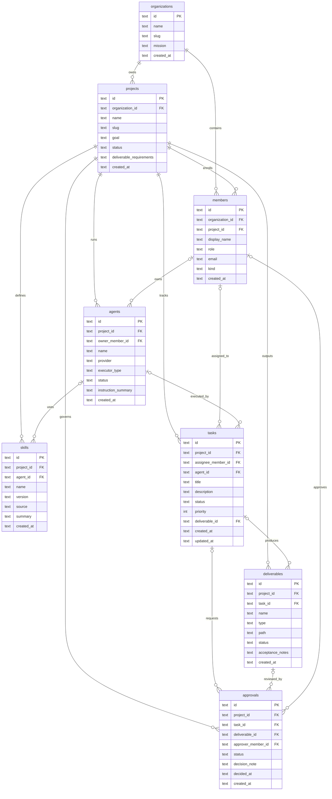

# 项目 Workspace 数据模型（Sprint 1）

目标：支撑“创建组织/项目空间，维护成员、Agent、任务、交付物和审批”的 MVP。

本轮范围只实现 8 张核心表：
- organizations
- projects
- members
- agents
- skills
- tasks
- deliverables
- approvals

不做：完整 RBAC、多租户隔离、Memory/MCP/执行器运行时持久化。

## 状态流转

任务 `tasks.status` 按验收要求固定为：
- `todo`
- `in_progress`
- `pending_confirmation`
- `done`

交付物与审批拆开：
- `deliverables.status`: `draft` / `submitted` / `approved` / `rejected`
- `approvals.status`: `pending` / `approved` / `rejected`

## 建模取舍

1. 组织和项目分层
   - `organizations` 表示客户/业务单元
   - `projects` 表示具体项目 Workspace

2. 成员与 Agent 分离
   - `members` 管“人”以及项目成员归属
   - `agents` 管数字员工/执行 Agent
   - `agents.owner_member_id` 可挂到某个负责人

3. Skill 单独成表
   - 方便未来做 Agent 技能挂载、版本化和来源追踪

4. 交付物与审批解耦
   - 一个任务可生成交付物
   - 审批记录既可关联任务也可关联交付物

5. 任务先不做依赖表
   - 本轮验收只要求状态流转，不要求 DAG
   - 后续如做拆卡依赖，可补 `task_dependencies`

## Mermaid ER 图

## 典型查询

1. 查某项目所有任务及其负责人/Agent
2. 查待确认任务（`pending_confirmation`）
3. 查某项目所有交付物和审批状态
4. 查某 Agent 绑定了哪些 Skill

## SQLite 注意点

- `schema.sql` 里写了 `PRAGMA foreign_keys = ON;`，用于建库时启用约束。
- 但 SQLite 的外键开关是“每个连接单独生效”，所以应用层每次新建连接都必须再次执行 `PRAGMA foreign_keys = ON`。
- `repository.py` 已在连接初始化时处理；`demo.py` 也显式做了独立连接校验。

## 目录

- `schema.sql`：SQLite DDL
- `schema.md`：ER 图和建模说明
- `repository.py`：轻量 dataclass + sqlite3 repository
- `demo.py`：建库、造数、状态流转与查询演示
