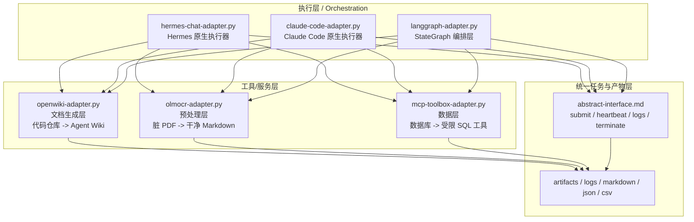

# AgentSpace 工具栈 adapters 借鉴清单

本文档只回答一个问题：在 Hermes-based 德勤 AI Native MVP 里，哪些开源项目值得借鉴，以及应该以什么 adapter 方式接入。

先重申 6-29 决策边界：

1. 借鉴不替代：OpenWiki、olmOCR、mcp-toolbox 都不是 Hermes 替代品，而是工具层借鉴对象。
2. 可插拔适配器：三个借鉴对象都通过统一接口接入现有 MVP，而不是把其原生 CLI 或 runtime 直接塞进主流程。
3. 独立可部署：每个组件都应可独立部署、模块化打包，并优先暴露为 OpenAI 兼容 API 或 MCP 协议，避免与执行器强耦合。

---

## 1. 定位与层次

从 AgentSpace 工具栈视角看，三个对象分别位于不同层：

- OpenWiki：文档生成层。把代码仓库、现有文档、git 历史转成 Agent 可读 Wiki，核心产物是结构化 Markdown，而不是执行器本身。
- olmOCR：预处理层。把脏 PDF、扫描件、双栏论文、表格型文档转成干净 Markdown，为知识入库和后续检索提供高质量语料。
- mcp-toolbox：数据层。把数据库访问收敛为受限 SQL 工具或 schema 查询工具，让 Agent 在边界内读取数据，而不是直接拿高权限连库。

因此，在现有 executor 体系里，这三者都应归类为“工具/服务层”，不属于 hermes-chat-adapter、claude-code-adapter 这类执行器。

推荐层次如下：

1. 执行层：langgraph-adapter.py 负责工作流编排，Hermes / Claude Code / Codex 等负责执行。
2. 工具层：OpenWiki adapter、olmOCR adapter、mcp-toolbox adapter 作为独立能力模块，被执行层按任务需要调用。
3. 交付层：日志、artifact、知识文件、数据库查询结果再回流到现有 abstract-interface.md 规定的统一结果对象里。

---

## 2. 与现有 abstract-interface.md 的映射原则

现有 abstract-interface.md 定义的是执行器抽象：submit、heartbeat、logs、pause、resume、terminate，以及统一的 input、status、failure_reason、output_files。

三个新 adapter 虽然不是执行器，但仍然应该映射到同一套任务语义，方式如下：

- submit：发起一次工具型任务，例如“生成 Wiki”“解析 PDF”“运行受限 SQL tool”。
- heartbeat：查询远端服务或本地 job 是否仍在运行。
- logs：回传结构化日志，包括输入源、处理状态、错误原因、输出 artifact。
- terminate：允许中止长任务，例如大批量 OCR 或长时文档生成。
- pause / resume：MVP 阶段可先作为逻辑状态保留，是否真实支持取决于底层服务。

也就是说，现有抽象接口不需要推翻；需要做的是把“执行器型 adapter”向上扩成“统一任务型 adapter”，工具层也按同一日志口径接入。

---

## 3. OpenWiki adapter 设计

### 3.1 借鉴的具体技术点

OpenWiki 真正值得借鉴的不是它那套完整 CLI 壳子，而是文档生成和增量维护的方法论。文章里最有价值的点有五个：第一，证据纪律，所有重要结论必须回指源码、现有文档或 git 历史，避免 Agent 编造系统结构；第二，Git 纪律，update 不是让模型临时猜哪里改了，而是宿主先收集 git status、git log、git diff 等证据，再交给文档 Agent 做影响面评估；第三，subagent 只读并行探索，适合大仓库扫描；第四，先生成 openwiki/_plan.md 再落文档，控制页面规划；第五，内容快照防抖，只有文档内容真的变化才更新元数据。德勤 MVP 应借鉴这些规则，把“代码仓库 -> Agent 可读 Wiki”做成受控 pipeline，而不是直接照搬 OpenWiki CLI。

### 3.2 与现有 abstract-interface.md 的映射关系

OpenWiki adapter 可以实现为一种 document-generation task。input 对应 repo_path、git_head、target_scope、existing_docs；status 使用 queued/running/succeeded/failed；failure_reason 记录证据缺失、仓库扫描失败或输出校验失败；output_files 则返回生成的 quickstart.md、architecture/*.md、workflows/*.md 等 Markdown 文件路径。它不替代 hermes-chat 或 claude-code，而是由这些执行器通过统一任务接口发起调用，再把结果纳入同一日志 schema。对于 abstract-interface.md 来说，它只是新的一类 task payload，与现有 executor registry 并不冲突。

### 3.3 独立部署方式

推荐把 OpenWiki adapter 拆成独立微服务而不是嵌入主进程。最轻量方案是 Docker 包一层 Python/Node 服务，暴露一个 OpenAI 兼容的 tasks API，例如 /v1/wiki/init、/v1/wiki/update；内部可调用 Git、文件系统扫描器、LangGraph 或普通 LLM route。若后续需要更标准化工具接入，也可以再包成 MCP server，把“生成 wiki”“更新 wiki”“获取计划稿”暴露为 MCP tools。这里的关键不是复刻 OpenWiki 原生 runtime，而是保留独立部署、可水平替换、可通过容器或 sidecar 上线的形态。

### 3.4 AgentSpace 集成点

AgentSpace 里，OpenWiki adapter 属于文档服务层。langgraph-adapter 可在 research 或 deliver 阶段触发它，用于把新代码仓库先整理成 Agent 可读知识底座；hermes-chat-adapter 可把“请为这个仓库补 wiki”转成 submit 请求；claude-code-adapter 或 Codex 执行器则可在代码变更完成后触发一次增量 update。也就是说，Hermes、Claude Code、Codex 都是调用方，不是被替代对象。统一入口仍然是 Hermes-based MVP，只是把 OpenWiki 变成一个可插拔的 downstream service。

### 3.5 风险/合规关注

生产环境里，OpenWiki 类服务的最大风险不是模型质量，而是越权扫描和文档失真。必须限制扫描目录白名单，禁止读取 .env、密钥文件和无关私有数据；必须把 git 证据与输出文档绑定，避免“无证据生成”；必须控制增量更新预算，防止一次变更把整套 Wiki 全量重写；还要注意生成文档里不能泄露内部 URL、凭证样例和客户敏感字段。对咨询交付场景，建议保留人工 review 位，尤其是 architecture 与 operations 文档。

---

## 4. olmOCR adapter 设计

### 4.1 借鉴的具体技术点

olmOCR 的借鉴重点是“为 LLM 喂干净材料”这条预处理思路，而不只是 OCR 识字。文章里有几个关键点：第一，它强调 natural reading order，解决双栏、图注、页眉页脚、表格和公式的线性化问题；第二，它的目标输出是干净 Markdown 或文本，直接面向知识库与 RAG 输入；第三，它采用 7B 视觉语言模型，本地通常需要 GPU、vLLM 和较重依赖，这意味着它天然更像共享解析服务，不像桌面脚本；第四，它自带 benchmark 思维，适合用企业真实文档集比较扫描合同、财报、论文的解析质量；第五，它支持远程推理，可挂到外部 vLLM 或 OpenAI 兼容 API 后面。德勤 MVP 借鉴的是这套“脏 PDF -> 干净 Markdown -> 再入库”的工程化切分。

### 4.2 与现有 abstract-interface.md 的映射关系

olmOCR adapter 对 abstract-interface.md 的映射最直接：input 是 pdf_path、image_path、document_type、target_format、parser_profile；status 反映解析任务状态；failure_reason 记录渲染失败、GPU 不足、版式识别异常、超时等；output_files 返回 Markdown、纯文本、页面级 JSON、可选截图等 artifact。对于上层执行器来说，它表现为一个长时工具任务：Hermes 或 Claude Code 提交解析任务，轮询 heartbeat，看 logs，拿到输出后再进入知识入库或摘要生成流程。这样预处理层就能与执行层解耦。

### 4.3 独立部署方式

olmOCR 建议独立部署为 GPU 服务。优先方案是 Docker + vLLM，把视觉模型托管成 OpenAI 兼容 API；在资源紧张或需要集中治理的环境里，也可直接接已验证 provider，避免每台执行器节点都背 30GB 镜像和 CUDA 依赖。对于本地实验，可提供一个 batch CLI wrapper；但面向德勤 MVP，正式形态应是服务化接口，例如 /v1/ocr/parse 或 /v1/ocr/batch-parse，再由 Python adapter 封装调用逻辑。这样既满足独立可部署，也便于后续把 OCR 能力复用给多个执行器。

### 4.4 AgentSpace 集成点

在 AgentSpace 里，olmOCR adapter 应放在所有知识动作之前。Hermes 可在用户上传 PDF 或指定文档目录时先触发 OCR 预处理；langgraph-adapter 可以把它设为 ingest 流程的第一节点；Claude Code 或 Codex 在需要读取合同、招标书、扫描报告时，也可以通过统一 service 调用而不是自己拼 OCR 脚本。OCR 输出的 Markdown 再流向 OpenWiki 或知识库索引层。换句话说，olmOCR 不是执行器，而是所有执行器共用的前置文档清洗服务。

### 4.5 风险/合规关注

olmOCR 类组件的风险主要集中在资源与合规。资源侧要注意 GPU 占用、批量文档排队、超时和成本；质量侧要建立抽样复核，避免公式、表格、页码或关键条款识别错误后直接入库；合规侧要区分可外发文档与必须内网处理文档，尤其是客户合同、财报、投标材料和身份证明类扫描件。若采用远程 provider，必须先确认数据驻留、日志留存和模型侧不训练客户数据等条款。

---

## 5. mcp-toolbox adapter 设计

### 5.1 借鉴的具体技术点

mcp-toolbox 最值得借鉴的是“给 Agent 发受限武器”的设计，而不是让 Agent 拿数据库高权限直连。文章里有四个核心点：第一，prebuilt mode 能快速暴露 list_tables、get_schema、execute_sql，适合开发调试；第二，真正适合生产的是自定义 tools.yaml，把 SQL 模板化、参数化、可审计化，严格限制 Agent 的查询边界；第三，它把连接池、IAM、OpenTelemetry 等基础设施一起考虑，说明其定位不是 demo 脚本，而是数据库工具平台；第四，它支持 MCP server、HTTP 接入和 skills-generate，天然适合分发给 Claude Code、Codex、Gemini CLI 一类执行器。德勤 MVP 应重点借鉴“受限 SQL 工具层”与“工具包可分发”这两点。

### 5.2 与现有 abstract-interface.md 的映射关系

mcp-toolbox adapter 可以抽象成 data-access task。input 包括 datasource_id、tool_name、query_params、requester、approval_context；status 依旧走统一状态；failure_reason 覆盖鉴权失败、工具不存在、参数校验失败、查询超时；output_files 可选保存为 JSON、CSV、Markdown 摘要或 query audit log。与现有 abstract-interface.md 的关系是：它不是新的执行器，而是被执行器 submit 的工具型任务。对于上层注册表，只需增加一个 toolbox 类 adapter，让日志 schema 继续统一记录“输入、状态、失败原因、输出文件”。

### 5.3 独立部署方式

mcp-toolbox 天然适合独立部署。开发环境可以直接以 Docker 或官方 server 方式起一个 MCP/HTTP 服务；生产环境则应按数据源拆分 deployment，并通过 tools.yaml 管理只读查询、聚合查询和白名单 schema。对德勤 MVP，建议保留两种接入面：一层是 MCP server，供 Claude Code、Codex、Gemini CLI 等原生 MCP 客户端直接消费；另一层是一个轻薄的 Python adapter，把 MCP 调用再包装成 Hermes 内部统一任务接口，便于日志、审计和权限前置。

### 5.4 AgentSpace 集成点

AgentSpace 里，mcp-toolbox adapter 是数据库访问网关。Hermes-chat-adapter 可以把“查表结构”“看最近一周订单趋势”转成受限 tool call；langgraph-adapter 可以把它嵌入分析节点，让状态图根据查询结果继续决策；Claude Code、Codex 等执行器若具备 MCP client，也可以直连 toolbox，但仍应通过 Hermes 的任务注册与审计层收口日志。这样可以同时满足开发效率和平台治理，不会把数据库访问散落到多个执行器私有脚本里。

### 5.5 风险/合规关注

mcp-toolbox 的首要风险是权限失控。prebuilt mode 自带 execute_sql，开发时方便，生产时危险，因此必须默认禁用高风险写操作，只开放参数化只读工具；其次要做行级、表级和环境级隔离，避免测试 Agent 误读生产数据；再次要建立审计链路，记录谁、何时、通过哪个 tool 查询了什么；最后要处理个人信息、财务数据、客户数据等敏感字段脱敏，不能因为“是 AI 在查”就绕过数据治理要求。

---

## 6. 三层架构图

这个图强调两点：

1. OpenWiki / olmOCR / mcp-toolbox 都在工具/服务层，不是执行器。
2. langgraph-adapter、hermes-chat-adapter、claude-code-adapter 都可以作为调用方，通过统一接口回收日志与产物。

---

## 7. 与现有 adapter 的关系

现有文件应这样理解：

- langgraph-adapter.py：执行层编排器，借鉴 LangGraph StateGraph，负责把任务拆成 research、analyze、approval、deliver 等显式节点。
- hermes-chat-adapter.py：Hermes 原生执行器，负责把 Hermes chat CLI 封装成统一执行器接口。
- claude-code-adapter.py：Claude Code 原生执行器，负责把 Claude Code CLI 或 mock 封装成统一执行器接口。

今天新增的三个 adapter 则属于工具/服务层：

- openwiki-adapter.py：文档生成服务 adapter，不承载最终执行入口。
- olmocr-adapter.py：文档预处理服务 adapter，不负责对话或工作流编排。
- mcp-toolbox-adapter.py：数据库工具服务 adapter，不直接等于某个 agent runtime。

换句话说，现有 3 个 adapter 解决“谁来执行、怎么编排”；今天新增 3 个 adapter 解决“执行器可调用哪些标准化工具服务”。两组 adapter 是垂直关系，不是替代关系。

---

## 8. 下一步可执行项

下面给出三个 POC 代码骨架的建议目标，每个都已单独建文件，风格参考 langgraph-adapter.py 的 frontmatter、中文说明和 checkpoint 语气。

### 8.1 OpenWiki POC

目标：
- 输入 repo_path、mode(init/update)、git evidence。
- 调用独立的 wiki service 或本地 runner。
- 返回生成文件列表与最小日志。

建议先验证：
- 能否生成 quickstart.md。
- 能否根据 git diff 做一次小范围 update。
- 能否把 output_files 回填到统一任务日志。

### 8.2 olmOCR POC

目标：
- 输入 pdf_path、target_format、provider。
- 调用本地/远端 OCR service。
- 输出 Markdown 文件与页级元数据。

建议先验证：
- 合同、双栏论文、带表格 PDF 各取一份样本。
- 对比普通 OCR 和 olmOCR 输出顺序。
- 验证 output_files 与 failure_reason 是否能稳定回填。

### 8.3 mcp-toolbox POC

目标：
- 输入 datasource_id、tool_name、params。
- 通过 MCP 或 HTTP 调用受限 SQL tool。
- 输出 JSON/CSV 查询结果与审计日志。

建议先验证：
- list_tables / get_schema / 一个参数化只读查询。
- prebuilt 与 tools.yaml 两种模式的权限差异。
- 执行器直连 MCP 与 Hermes 统一收口两种接法的日志一致性。

---

## 9. 推荐落地顺序

建议按下面顺序推进，而不是三者同时深挖：

1. 先做 olmOCR adapter：它是知识入库前的地基，输入质量直接决定后面 Wiki 与检索效果。
2. 再做 OpenWiki adapter：等文档材料变干净，再沉淀成 Agent Wiki 才有稳定价值。
3. 最后做 mcp-toolbox adapter：它更多影响分析与业务数据访问，适合在核心文档链路跑通后接入。

这样推进，符合德勤 MVP 的最小闭环：文档先洗干净，再沉淀为可读知识，再让执行器按需触碰数据层。
