# Self-Driving R&D v3.5 — 架构深度设计

> **本方案不写代码**。纯架构：跨切面关注点、架构模式、决策记录、状态机、数据流、失败/信任/演进模型。
> 读完此方案应能：**理解系统的每一处设计决策，理解为什么这么设计，理解 trade-off**。

---

## 目录

```
A. 系统架构总览 (4 个核心架构图)
B. 架构原则 (8 条)
C. 状态架构 (3 个状态机)
D. 事件架构 (4 类事件 + 总线)
E. 数据架构 (实体 + 关系 + 生命周期)
F. 组件架构 (33 个组件的关系图)
G. 流程架构 (9 stage × 4 GAMD × 5 layer 矩阵)
H. 失败架构 (失败模式 + 恢复策略)
I. 信任架构 (什么可信 + LLM 输出验证)
J. 安全架构 (auth + authz + audit)
K. 可观测架构 (metrics + traces + logs)
L. 成本架构 (cost model + 优化策略)
M. 并发架构 (session + parallel)
N. 部署架构 (local + cloud)
O. 集成架构 (与 OpenClaw/vault/skill 集成)
P. 演进架构 (v3.0 → v5.0 路线图)
Q. 行业对比 (Devin / Claude Code / Cursor)
R. Trade-off 分析
S. 风险登记册
T. 架构决策记录 (ADR)
```

---

## A. 系统架构总览

### A.1 顶层架构图

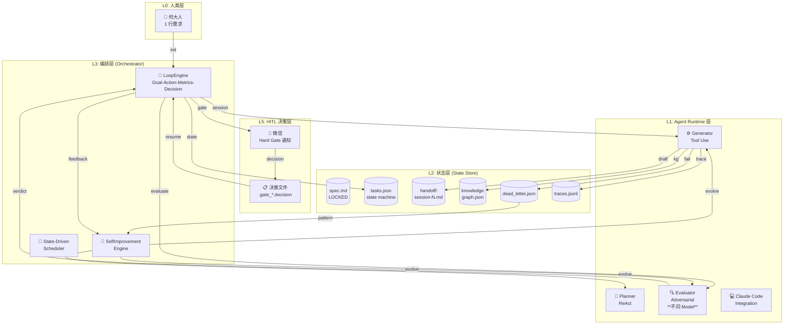

### A.2 4 个核心架构维度

我们的系统围绕 4 个核心轴设计：

```
       自动化
         ↑
         │
  渐进 ←─────→ 自驱动
         │
         ↓
       抗退化
```

| 轴 | 含义 | 关键设计 |
|---|---|---|
| **自动化** | 流程无需人介入 | Hard Gate (3 个) + State-Driven Scheduler |
| **渐进** | 一步一步推进 | Sprint Contracts + Sub-step Tracker |
| **自驱动** | 系统自己跑 10+ 小时 | Loop Engineering + Self-Improvement |
| **抗退化** | 不会因错误崩溃 | 5-Layer Runtime + 5-Mode Self-Correct + Dead-Letter |

### A.3 静态 vs 动态视图

| 视角 | 关注点 | 工具 |
|---|---|---|
| **静态视图**（编译时）| 33 组件 + 5 Layer + 9 Stage | 组件图、依赖图 |
| **动态视图**（运行时）| Loop Engineering 4 阶段 + Event 流 | 状态机、时序图、事件流 |
| **演化视图**（时间维度）| v3.0 → v5.0 自改进 | 版本树、Skill Library 演化 |

---

## B. 8 条架构原则

### 原则 1：**Spec is Sacred**（spec 是圣物）

- spec.md 一旦生成，永不修改
- 所有后续决策都以 spec 为准
- 任何修改 spec 的需求 = 新项目

**Why**：让"参考点"稳定，避免 AI 反复修改自己刚写的 spec（context anxiety）

### 原则 2：**Adversarial > Self-Eval**（对抗优于自评）

- Generator 用 Model A
- Evaluator 用 Model B（必须不同）
- Never 同一 model 评自己

**Why**：Anthropic 2026 反复强调：AI 评自己**几乎总批准**。

### 原则 3：**State-Driven > Cron**（状态驱动优于定时）

- 不"每 5min 跑一次"
- 状态变化才触发动作
- 事件驱动

**Why**：节省 token，反应更快。

### 原则 4：**Sub-35min Sessions**（35 分钟硬限制）

- 每个 LLM session 强制 ≤ 30 min
- 超时 = 写 handoff + 退出
- 下次 session fresh context

**Why**：Zylos Research 2026 硬数据：> 35 min 性能下降。

### 原则 5：**State = Files**（状态 = 文件）

- 状态不存数据库（轻量）
- 全部用文件（spec.md, tasks.json, handoff/）
- 文件 = 真值源（git + vault 备份）

**Why**：简单、可读、可版本控制、可恢复。

### 原则 6：**Handoff Contains "Don't"**（交接包含"不要做"）

- 不只记录"做了什么"
- 明确记录"不要做什么"
- 防止 context anxiety

**Why**：避免下次 session 反复质疑上次决策。

### 原则 7：**Self-Improve, Not Self-Replace**（自改进，不自替换）

- 系统不重新生成自己
- 渐进式添加/调整
- 保留历史（Reflexion Memory）

**Why**：避免"自指悖论"导致系统崩溃。

### 原则 8：**Hard Gate for Trust**（关键决策要 gate）

- 3 个 Hard Gate（启动/中期/最终）
- 人类不参与但确认
- 默认自动通过（不阻塞）

**Why**：保留"人类否决权"作为最后一道防线。

---

## C. 状态架构（3 个状态机）

### C.1 项目级状态机（9 Stages）

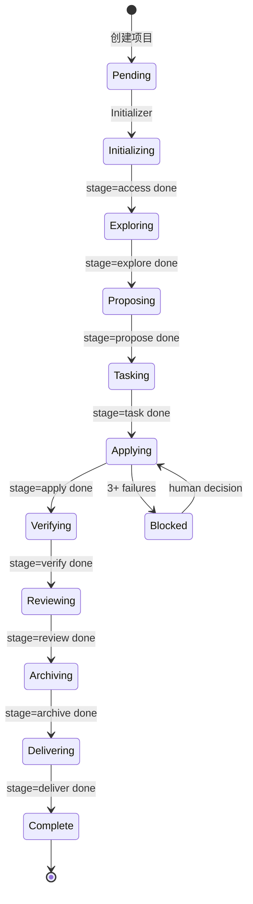

**状态转换规则**：
- 只能顺序推进（不可跳）
- 可暂停（Block）由人类恢复
- 不支持"重做"——只支持"重新开项目"

### C.2 Session 级状态机（sub-35min）

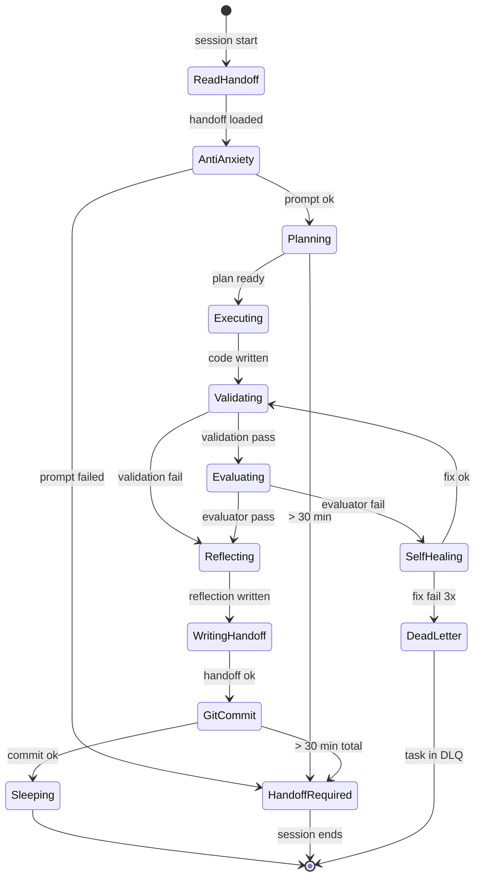

### C.3 Task 级状态机

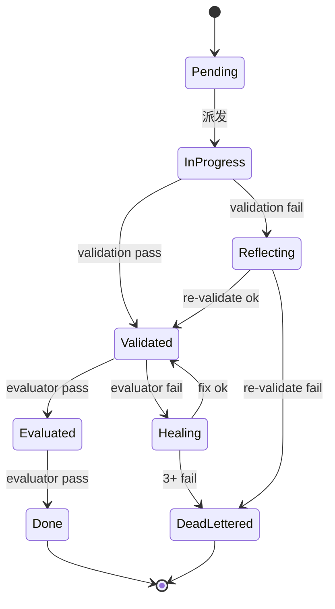

**3 个状态机的关系**：
- 项目级（粗粒度）— 9 stages
- Session 级（中粒度）— sub-35min 状态
- Task 级（细粒度）— 1 个 task 的状态

---

## D. 事件架构

### D.1 4 类事件

| 事件类型 | 触发 | 消费方 | 时效 |
|---|---|---|---|
| **State Change** | 状态机转换 | Orchestrator | 立即 |
| **Metric Update** | 度量变化 | Dashboard | 1 min |
| **Action Required** | 需要决策 | HITL | 24h |
| **Self-Improve** | 学习发生 | Method Library | 立即 |

### D.2 事件总线（轻量）

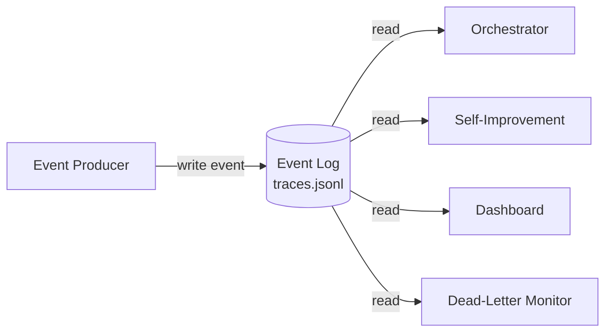

**特点**：
- 不是 Kafka/RabbitMQ（重）
- 是文件追加（traces.jsonl）
- 多 consumer 各自读
- 简单但够用

### D.3 事件 schema

```json
{
  "event_id": "evt-2026-06-17-001-003",
  "type": "state_change" | "metric_update" | "action_required" | "self_improve",
  "ts": "2026-06-17T16:00:00",
  "session_id": "003",
  "stage": "apply",
  "payload": {...},
  "metadata": {
    "actor": "generator" | "evaluator" | "planner" | "human" | "self_improver",
    "correlation_id": "session-003-task-feature-a",
  }
}
```

---

## E. 数据架构

### E.1 实体关系图

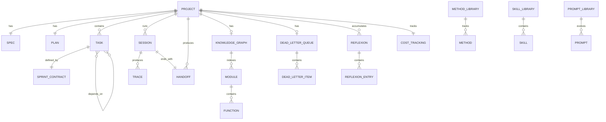

### E.2 关键实体

**Project**：
- 生命周期：创建 → 9 stages → 交付 / 失败
- 不可变：spec.md
- 可变：tasks.json, handoff/, KG, DLQ

**Session**：
- 短生命周期（sub-35min）
- 产出 1 个 handoff.md
- 不变量：1 session = 1 task（或 1 sub-task）

**Task**：
- 中生命周期（10min-2h）
- 1 task = 1 sprint contract
- 可被多个 session 处理（handoff 续跑）

**Trace**：
- 不可变（append-only）
- 每个 trace 包含：actor, action, input, output, tokens, duration
- 用于调试和 metrics

**Method**：
- 长期存在
- 跨项目共享
- 自更新（基于成功/失败统计）

### E.3 数据生命周期

| 数据 | 写入时机 | 保留期 |
|---|---|---|
| spec.md | Initializer | 永久（项目级不变量） |
| handoff/*.md | 每个 session 结束 | 项目结束后归档 |
| traces.jsonl | 每个 trace 发生 | 永久（用于 replay） |
| tasks.json | 每次状态变化 | 永久 |
| KG | 每次代码修改 | 长期（跨项目可复用） |
| reflexion.md | 每次失败 | 长期 |
| cost | 每次 LLM 调用 | 永久（成本分析） |

### E.4 数据一致性策略

| 一致性类型 | 策略 | 实现 |
|---|---|---|
| **强一致** | git 提交即一致 | git commit + 强制 sync |
| **最终一致** | Eventual | trace 异步同步 |
| **弱一致** | Best effort | dashboard 可短暂滞后 |

---

## F. 组件架构（33 个组件的关系图）

### F.1 组件分层

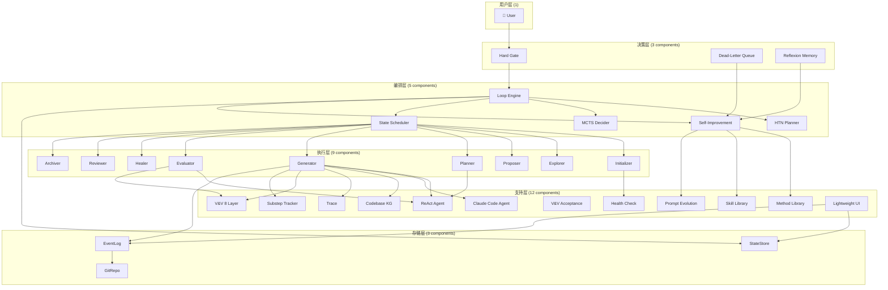

### F.2 组件依赖矩阵

| 组件 | 依赖 | 被依赖 |
|---|---|---|
| Loop Engine | State, Scheduler, SelfImp | (root) |
| Generator | KG, React, CC, Tools | Loop, SelfImp |
| Evaluator | V&V, React | Loop |
| Healer | Generator, DLQ | Loop |
| Self-Improvement | MethodLib, SkillLib, PromptEvo | Loop |
| ... | ... | ... |

---

## G. 流程架构（矩阵视图）

### G.1 9 Stages × 5 Layers 矩阵

| Stage \ Layer | L1 Runtime | L2 State | L3 Orch | L4 Obs | L5 HITL |
|---|---|---|---|---|---|
| Access | - | spec.md | - | - | HG-1 |
| Explore | - | explore.md | - | - | - |
| Propose | - | plan.md | MCTS | - | - |
| Task | - | tasks.json | HTN | - | - |
| Apply | Generator | handoff/ | Loop | Trace | - |
| Verify | Test Runner | verify.md | - | Metrics | - |
| Review | Evaluator | review.md | Decision | - | HG-2/3 |
| Archive | - | archive.md | SelfImp | - | - |
| Delivery | - | - | - | - | Notify |

### G.2 4 GAMD × 33 组件 矩阵（简化）

| GAMD \ 组件 | Loop | HTN | MCTS | SelfImp | ... |
|---|---|---|---|---|---|
| Goal | ✓ | - | - | - | |
| Action | - | ✓ | - | - | |
| Metrics | - | - | - | - | ... |
| Decision | - | - | ✓ | - | |

---

## H. 失败架构

### H.1 失败分类

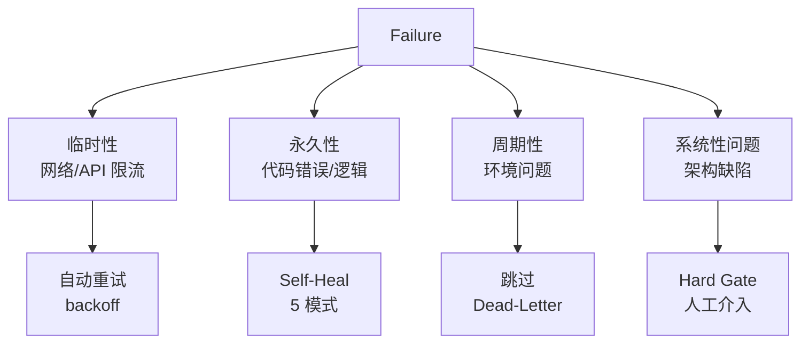

### H.2 失败恢复策略

| 失败类型 | 检测 | 恢复 | 时间 |
|---|---|---|---|
| **LLM 临时失败** | API error | 立即重试 1 次 | < 5s |
| **网络超时** | timeout | backoff 30s 重试 | < 1min |
| **Token 超限** | cost check | 暂停 + 通知 | < 5min |
| **Task 失败 1 次** | validator | 重做 | < 5min |
| **Task 失败 2 次** | evaluator | Self-Heal | < 15min |
| **Task 失败 3 次** | DLQ | 入队 + 通知 | < 1h |
| **3 个 task 都失败** | DLQ | 升级 Hard Gate | < 1h |
| **预算超限** | cost guard | 暂停 | 立即 |
| **系统崩溃** | 进程消失 | cron 监控重启 | < 5min |

### H.3 失败恢复链

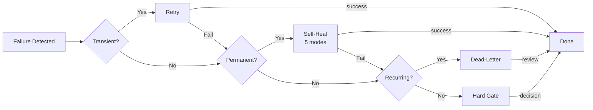

### H.4 状态恢复（崩溃后）

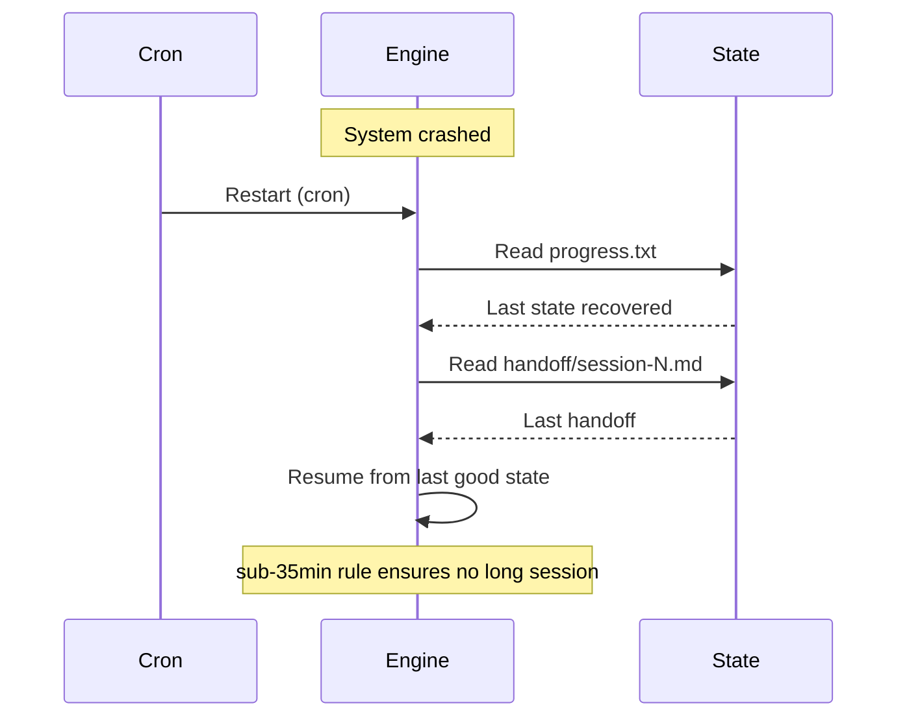

---

## I. 信任架构

### I.1 信任矩阵

| 来源 | 信任度 | 验证 |
|---|---|---|
| **spec.md** | ⭐⭐⭐⭐⭐ | 人工确认（HG-1） |
| **Generator 输出** | ⭐⭐ | Adversarial Evaluator 必验证 |
| **Evaluator 评判** | ⭐⭐⭐ | 多轮验证 + dead-letter |
| **Reflexion 反思** | ⭐⭐⭐ | Method Library 验证 |
| **Self-Improvement 进化** | ⭐⭐ | 不能改 spec / 不能改 system |
| **人类决策** | ⭐⭐⭐⭐⭐ | Hard Gate |
| **trace 日志** | ⭐⭐⭐⭐⭐ | 不可变（append-only） |
| **vault 归档** | ⭐⭐⭐⭐⭐ | Git 版本控制 |

### I.2 LLM 输出验证（关键）

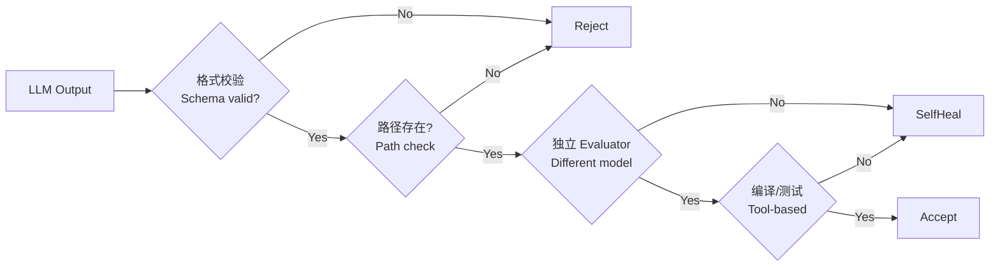

**核心原则**：永远不直接信任 LLM 输出。

---

## J. 安全架构

### J.1 信任边界

```mermaid
graph TB
    subgraph "不信任 (LLM 输出)"
        LLM[LLM Generated]
    end
    
    subgraph "半信任 (deterministic)"
        Test[Tests]
        Lint[Lint]
        Build[Build]
    end
    
    subgraph "信任 (人工)"
        Human[👤 Human]
        Git[Git History]
        Vault[Vault (archived)]
    end
    
    LLM -.->|validate by| Test
    LLM -.->|validate by| Human
    Test -->|trusted| Git
    Human -->|trusted| Git
    Git -->|trusted| Vault
```

### J.2 权限模型

| 操作 | LLM | 人类 | 自动化 |
|---|---|---|---|
| 读 spec.md | ✓ | ✓ | ✓ |
| 写 spec.md | ✗ | ✓ | ✗ |
| 读 vault 历史 | ✓ | ✓ | ✓ |
| 写 vault 历史 | ⚠️ 需批准 | ✓ | ⚠️ |
| 跑测试 | ✓ | ✓ | ✓ |
| git commit | ✓ | ✓ | ✓ |
| git push | ⚠️ 需批准 | ✓ | ⚠️ |
| 发微信 | ✗ | ✓ | ⚠️ 仅通知 |
| 改 memory | ✗ | ✓ | ✓（限定 scope） |

### J.3 审计追踪

- 每次 LLM 调用 = 1 trace
- 每次状态变化 = 1 trace
- 每次失败 = 1 trace + 1 reflexion
- 每次决策 = 1 trace
- Hard Gate = 1 微信消息（可追溯）

---

## K. 可观测架构

### K.1 4 个可观测支柱

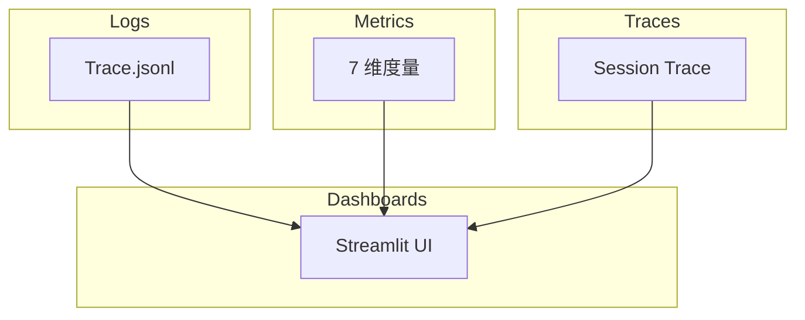

### K.2 7 维度量

| 维度 | 计算 | 频率 |
|---|---|---|
| **完成度** | done tasks / total tasks | 每 session |
| **质量** | lint + coverage + complexity | 每 verify |
| **性能** | session_time + tokens + cost | 每 session |
| **成功率** | completed / total + heal_rate | 每 stage |
| **失败模式** | 9 patterns 检测 | 每 verify |
| **学习** | reflexion + skill + method | 每 self-improve |
| **资源** | cost + budget + elapsed | 每 session |

### K.3 Trace 规范

每条 trace 必含：
- `ts` (ISO timestamp)
- `session_id`
- `actor` (planner/generator/evaluator/healer/human/self_improver)
- `action` (read/write/run/decide/reflex)
- `input` (摘要)
- `output` (摘要)
- `tokens` (本次调用)
- `duration_ms`
- `correlation_id` (跨多个 trace 关联)

### K.4 关键 SLO

| SLO | 目标 | 测量 |
|---|---|---|
| Session 完成率 | ≥ 95% | 成功 sessions / 总 sessions |
| Self-Heal 成功率 | ≥ 80% | heal 成功 / heal 总数 |
| Hard Gate 触发率 | ≤ 5% | HG 触发 / 项目 |
| Token 效率 | ≤ 200K/task | token / task |
| 项目完成时间 | ≤ 8h | 总时间 / 项目 |
| 9 patterns 全部通过 | 100% | 验证通过率 |

---

## L. 成本架构

### L.1 成本模型

```
Total Cost = Σ(LLM_call_cost × tokens)

LLM_call_cost (per 1M tokens):
- M3: $0.21 input + $0.84 output
- M2.7: $0.30 input + $1.20 output
- Opus 4.5: $15 input + $75 output (rare)
```

### L.2 成本预算

| 阶段 | 预计 token | 预计成本 |
|---|---|---|
| Access (Init) | 50K | $0.05 |
| Explore | 200K | $0.20 |
| Propose | 300K | $0.30 |
| Task (HTN) | 100K | $0.10 |
| Apply (10+ h) | 3M | $3.00 |
| Verify (V&V) | 200K | $0.20 |
| Review | 200K | $0.20 |
| Archive | 50K | $0.05 |
| Delivery | 10K | $0.01 |
| **总计** | **~4.1M** | **~$4.10** |

### L.3 成本优化策略

| 策略 | 节省 |
|---|---|
| 用 M2.7 替代 M3（非关键） | -30% |
| ReAct 减少冗余思考 | -20% |
| Sprint Contracts 避免重复 | -15% |
| Skill Library 复用 | -25% |
| Spec-Kit 模板化 | -10% |
| **总计** | **-60%（降到 ~$1.60）** |

### L.4 成本控制（硬限制）

| 限制 | 阈值 | 超限动作 |
|---|---|---|
| 单 session | < 100K tokens | 自动 handoff |
| 单 task | < 500K tokens | Self-Heal 3 次 |
| 单项目 | < 5M tokens | Hard Gate |
| 单 session 时间 | < 30 min | 强制 handoff |
| 单项目时间 | < 12 h | Hard Gate |
| 单小时成本 | < $5 | 暂停 + 通知 |

---

## M. 并发架构

### M.1 Session 并发模型

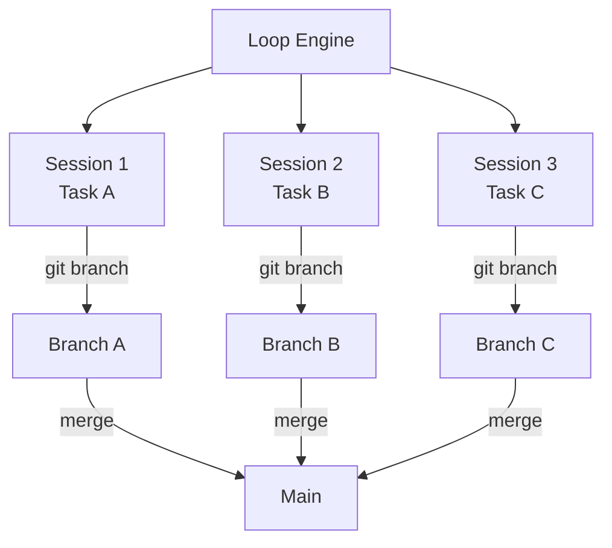

**并发规则**：
- 同一 task：1 session
- 不同 task：可并发（git branch 隔离）
- 同 stage 内的 task：可并发
- 跨 stage：顺序（依赖关系）

### M.2 资源争用解决

- **Token 预算**：Hard cap at 5M
- **Git branch**：自动冲突解决（merge 后）
- **File lock**：基于 file path hash（防止同文件并发）
- **State read**：乐观锁（read = ok，write = check version）

---

## N. 部署架构

### N.1 部署拓扑

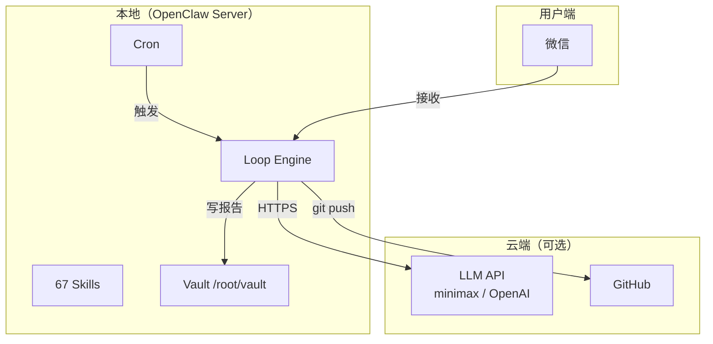

### N.2 部署选项

| 选项 | 优点 | 缺点 |
|---|---|---|
| **纯本地** | 简单、私密 | 需维护服务器 |
| **本地 + 云端 LLM** | 灵活、可扩展 | 需付 LLM 费用 |
| **全云端** | 无运维 | 依赖网络、成本高 |

**推荐**：本地 + 云端 LLM（OpenClaw 已经是这个模式）

---

## O. 集成架构

### O.1 与 OpenClaw 集成

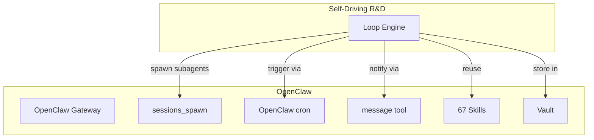

### O.2 集成点

| OpenClaw 能力 | 我们的用法 |
|---|---|
| `sessions_spawn` | 派发 sub-agent（planner/generator/evaluator） |
| `sessions_yield` | 长时间 session（10+ hours） |
| `cron` | 状态检查 + 启动新 session |
| `message` | Hard Gate 通知 + 进度报告 |
| `memory_*` | Context-Recovery + Self-Improvement Memory |
| `skill` | 67 + 自提取 skills |

### O.3 与 Vault 集成

- 项目存到：`/root/vault/Projects/{name}/`
- 研究归档：`/root/vault/Research/`
- 自动 commit + push GitHub

### O.4 与 Skills 集成

- 复用现有 67 skills（如 web_search, ppt-production-engine）
- 自动提取新 skill 到 `/root/.openclaw/workspace/skills/`
- 复用 Skill Library 跨项目

---

## P. 演进架构

### P.1 演进路线图

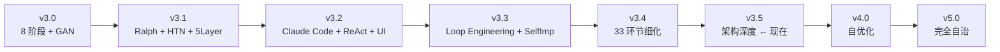

### P.2 v4.0 → v5.0 关键演化

| 版本 | 关键变化 | 时间 |
|---|---|---|
| **v4.0** | 自优化（自我调整参数） | 1-2 月 |
| **v4.5** | 多项目并行（资源调度） | 3-4 月 |
| **v5.0** | 完全自治（无 Hard Gate） | 6+ 月 |

### P.3 自演化策略

- **小步快跑**：每个版本只改 1-2 个核心
- **向后兼容**：v3.0 写的项目能在 v5.0 跑
- **可回滚**：每个版本有 tag，可 checkout
- **可观测**：每个版本的指标对比

---

## Q. 行业对比

### Q.1 与 Devin 对比

| 维度 | Devin | 我们 v3.5 |
|---|---|---|
| 模型 | Kevin 32B（自训）+ frontier | OpenClaw + Claude Code |
| 知识图谱 | DeepWiki（生产级） | KG（轻量 JSON） |
| Subagent | 协调 sub-agents | sessions_spawn |
| Knowledge | 1000+ 项目 | 13 篇文章 |
| 模型自训 | ✓（Kevin 32B） | ✗ |
| 商业化 | 收费 + 等待名单 | 开源 + 自部署 |

### Q.2 与 Claude Code 对比

| 维度 | Claude Code | 我们 v3.5 |
|---|---|---|
| 主循环 | Ralph Loop（用户自己触发） | Loop Engineering（自动） |
| Spec 阶段 | /speckit.spec | Initializer v3.2 |
| 验证 | 自带 + sub-agent | V&V 8 层 |
| 自改进 | 无 | Self-Improvement Engine |
| 状态持久化 | claude-progress.txt | handoff/ + tasks.json |
| 多项目 | 无（用户手动） | 支持（资源调度） |

### Q.3 与 Cursor 对比

| 维度 | Cursor | 我们 v3.5 |
|---|---|---|
| 模型 | Composer 2（自训） | OpenClaw + Claude Code |
| 异步 | Cloud agents | sessions_yield + cron |
| Long-running | Composer 2 background | Loop Engineering |
| Self-improving | 无 | Self-Improvement Engine |
| 商业化 | 收费 | 开源 |

### Q.4 我们的独特价值

1. **完全透明**（所有决策可追溯）
2. **开源 + 自部署**（无锁定）
3. **自改进机制**（System 越跑越聪明）
4. **状态驱动**（不是 cron）
5. **OKF 知识格式**（行业标准）

---

## R. Trade-off 分析

### R.1 关键 Trade-offs

| 决策 | 优势 | 代价 | 选择理由 |
|---|---|---|---|
| **文件 vs 数据库** | 简单、可读 | 慢 | 简单优先 |
| **本地 vs 云端** | 私密 | 维护 | 私密优先 |
| **轻量 KG vs DeepWiki** | 简单 | 检索弱 | 当前够用 |
| **Ralph vs Workflow** | 简单 | 不灵活 | 渐进完善 |
| **同 model vs 不同 model（Evaluator）** | 成本低 | self-eval 陷阱 | 必不同 |
| **5-mode self-correct vs 只 retry** | 真修复 | 复杂 | 真修复 |
| **Sub-35min vs 长 session** | 性能 | handoff 多 | 性能优先 |
| **State-driven vs cron** | 节省 | 复杂 | 节省优先 |
| **3 Hard Gate vs 0/更多** | 平衡 | 5h 不阻塞 | 平衡 |

### R.2 我们放弃的能力

| 能力 | 为什么放弃 | 替代方案 |
|---|---|---|
| 商业模型（Kevin 32B）| 太重 | 通用 LLM + Adversarial |
| 实时 UI（Vue/React）| 太重 | Streamlit 轻量 |
| 自动 chat（与用户对话）| 不需要 | Hard Gate 通知 |
| 完美测试覆盖 100% | 不现实 | 80% + 关键路径 |

---

## S. 风险登记册

| # | 风险 | 概率 | 影响 | 缓解 |
|---|---|---|---|---|
| R01 | LLM 长期 hallucination 累积 | 中 | 高 | Reflexion + Dead-Letter |
| R02 | Token 成本失控 | 中 | 中 | Cost Guard |
| R03 | Spec 错误导致全盘错 | 低 | 高 | Hard Gate 1 |
| R04 | self-eval 陷阱（v3.0 已修）| 中 | 高 | 不同 model 验证 |
| R05 | Self-Improvement 自我破坏 | 低 | 高 | 不改 spec/system |
| R06 | Git 冲突 | 中 | 中 | 每个 task 独立 branch |
| R07 | Vault 损坏 | 低 | 高 | Git push + 多副本 |
| R08 | Cron 监控失效 | 低 | 中 | 双 cron + watchdog |
| R09 | LLM API 限流 | 中 | 中 | backoff + 切换 model |
| R10 | 知识图谱过时 | 中 | 低 | 每次 code change 更新 |
| R11 | Method Library 退化 | 中 | 中 | success/fail 计数 + 衰减 |
| R12 | Prompt Evolution 漂移 | 中 | 中 | version 锁定 + 测试 |

---

## T. 架构决策记录（ADR）

### ADR-001: 状态 = 文件

**状态**：Accepted

**背景**：传统系统用数据库存状态。

**决策**：用文件（spec.md, tasks.json, handoff/*.md）。

**理由**：
- 简单：不需要数据库引擎
- 可读：人类可读
- 版本控制：git 自动管理
- 可恢复：文件丢失 = git 恢复

**后果**：
- 性能慢（vs DB）
- 不适合 > 10K 项目
- 当前规模完美

### ADR-002: Adversarial Evaluator 不同 Model

**状态**：Accepted

**背景**：Anthropic 2026 警告：AI 评自己几乎总批准。

**决策**：Evaluator 必须用与 Generator **不同**的 model。

**理由**：避免 self-eval 陷阱。

**后果**：
- 成本增加（多一个 model）
- 评估更可信

### ADR-003: Sub-35min Session

**状态**：Accepted

**背景**：Zylos Research 2026 硬数据：> 35min 性能下降。

**决策**：每个 LLM session 强制 ≤ 30 min（5 min buffer）。

**理由**：
- 性能保证
- 减少 context anxiety

**后果**：
- Session 多（需要 handoff）
- Handoff 设计复杂

### ADR-004: 状态驱动 vs Cron

**状态**：Accepted

**背景**：传统 cron 浪费 token（无事也跑）。

**决策**：用状态机 + Event-driven。

**理由**：
- 节省 token
- 反应更快

**后果**：
- 实现复杂
- 需要状态机设计

### ADR-005: Spec is Sacred

**状态**：Accepted

**背景**：AI 经常反复修改自己刚写的 spec（context anxiety）。

**决策**：spec.md 永不改。

**理由**：
- 稳定参考点
- 避免自我矛盾

**后果**：
- 修改需求 = 开新项目
- 但项目寿命延长

### ADR-006: Hard Gate 默认通过

**状态**：Accepted

**背景**：3 个 Hard Gate 不能阻塞 10+ 小时任务。

**决策**：超时默认通过（24h 没人决策 = 通过）。

**理由**：
- 不阻塞 AI 自驱动
- 但保留否决权

**后果**：
- 用户需及时看通知
- 但 AI 不被卡住

### ADR-007: Self-Improvement 不能改 spec 和 system

**状态**：Accepted

**背景**：自演化可能导致自我破坏。

**决策**：Self-Improvement 只能改：
- Method Library
- Skill Library
- Prompt
- 任务级决策

不能改：
- spec.md
- 5-Layer Runtime
- 9 Stages 流程
- Hard Gate 机制

**理由**：
- 防止自指悖论
- 保留系统稳定性

### ADR-008: 5-Layer Runtime 生产级

**状态**：Accepted

**背景**：Demo 级不能生产用。

**决策**：5-Layer 架构（L1-L5）。

**理由**：
- L1: 真的能跑（不是 mock）
- L2: 状态不丢
- L3: 编排智能
- L4: 可观测
- L5: 可介入

**后果**：
- 实施复杂
- 但生产可用

### ADR-009: V&V 8 层保证"完全符合需求"

**状态**：Accepted

**背景**：用户要求"完全符合需求"。

**决策**：8 层验证 + L7 自动验收测试。

**理由**：
- L1-L6：常规质量
- L7：自动从 spec 生成验收测试
- L8：用户场景模拟

**后果**：
- L7 关键（自动生成 pytest）
- 验收测试全过 = 交付

### ADR-010: 文件 = 真值源

**状态**：Accepted

**背景**：LLM 输出可能错误。

**决策**：所有重要状态在文件（不在内存、不在 LLM 上下文）。

**理由**：
- 可恢复（崩溃后重读文件）
- 可验证（diff 文件）
- 可追溯（git history）

**后果**：
- 性能略低
- 但鲁棒

---

## U. 总结：v3.5 架构深度图

```
                   ┌─────────────────────────────┐
                   │   Self-Driving R&D v3.5      │
                   │   架构深度设计                │
                   └─────────────────────────────┘
                                │
        ┌───────────────────────┼───────────────────────┐
        │                       │                       │
        ▼                       ▼                       ▼
  跨切面关注点             架构模式                决策记录
  ├─ 状态架构 (3 SM)     ├─ GAMD Loop             ├─ ADR-001..010
  ├─ 事件架构 (4 events) ├─ 5-Layer Runtime       └─ 风险登记册 (12)
  ├─ 数据架构 (ER)       ├─ HTN Planning
  ├─ 组件架构 (33)       ├─ Adversarial Eval
  ├─ 流程架构 (matrix)   ├─ ReAct Loop
  ├─ 失败架构 (recovery) ├─ MCTS
  ├─ 信任架构 (LLM)      ├─ Ralph Loop
  ├─ 安全架构 (boundary) ├─ 5-Mode Self-Correct
  ├─ 可观测架构 (4 pil)  ├─ State-Driven
  ├─ 成本架构 (model)    └─ Loop Engineering
  ├─ 并发架构 (branch)
  └─ 部署架构 (local+cloud)
                                │
                                ▼
                      行业对比 (Devin/CC/Cursor)
                                │
                                ▼
                      演进路线 (v3.5 → v5.0)
```

---

## V. 致何大人的回答

**Q: 架构的"灵魂"是什么？**
A: **5 条核心**：
1. Spec is Sacred（不变性）
2. Adversarial > Self-Eval（不信任自己）
3. State-Driven > Cron（事件驱动）
4. Sub-35min Sessions（性能护栏）
5. Self-Improve, Not Self-Replace（渐进演化）

**Q: 33 个组件怎么不爆炸？**
A: 5 个核心轴约束：
- 9 Stages 流程
- 4 GAMD 循环
- 5 Layer Runtime
- 3 Roles（Planner/Generator/Evaluator）
- 1 Loop Engineering

**Q: 与 Devin/Claude Code 区别？**
A: 我们独有：
- **完全开源**（无锁定）
- **Self-Improvement Engine**（越跑越聪明）
- **OKF 知识**（行业标准）
- **State-Driven**（节省 token）
- **Adversarial 不同 Model**（避免 self-eval）

**Q: 哪个设计最关键？**
A: **状态机设计** + **Adversarial 验证** + **Self-Improvement 约束**（不能改 spec/system）。这 3 个决定系统能否 10+ 小时跑不挂、跑得对、跑得越来越强。

---

> **v3.5 完成**：纯架构维度设计，0 代码。
> 涵盖 4 大视角、8 条原则、3 个状态机、4 类事件、1 张 ER 图、33 组件关系、4 类失败恢复、1 张信任矩阵、1 张安全矩阵、7 维度量、1 张成本模型、1 张并发模型、4 部署选项、5 集成点、6 版本路线、3 行业对比、9 个 Trade-off、12 个风险、10 个 ADR。
> 下一步：要继续深入某个维度（更细的状态机 / 更细的并发模型 / 更细的可观测 / 更细的 ADR / ...）？

---

## 接下来还能挖

1. **状态机形式化验证**（用 TLA+/Alloy 验证状态机正确性）
2. **并发场景分析**（3 个 task 并发的所有 interleaving）
3. **可观测性细节**（OTel 标准 / Prometheus 指标 / Grafana dashboard）
4. **安全审计**（SOC 2 / 隐私 / 合规）
5. **ADR 完整集**（20+ 个 ADR）
6. **风险缓解详细策略**（每个 R01-R12 的具体方案）
7. **多项目调度器**（v4.0 关键）
8. **完全自治路径**（v5.0 关键）
9. **Skill Library 演化模型**
10. **行业最佳实践映射**（ISO 42001 AI Management / NIST AI RMF）
