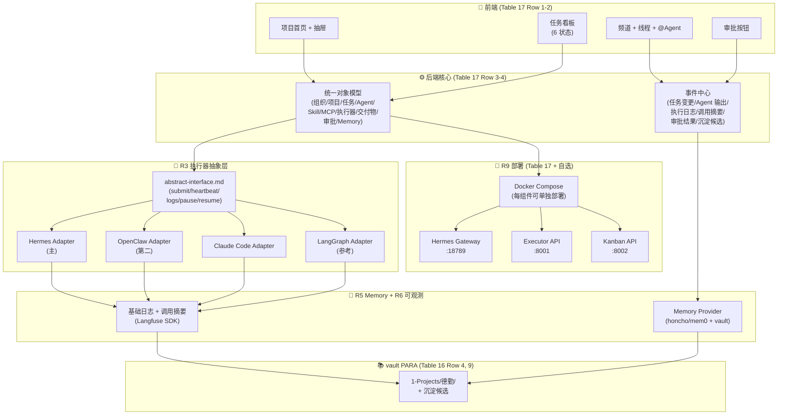

# 平凯 Loop vs 德勤 v0.3 对照架构图

> 一图看清：**Loop 哪里能借鉴** / **v0.3 哪里必须自研**

## 1. 平凯 Loop 架构（实际部署形态）

```mermaid
graph TB
    subgraph Client["📱 客户端层"]
        Web["Loop Web<br/>(团队工作台)"]
        Desktop["Loop Desktop<br/>(桌面客户端)"]
        CLI["Loop CLI<br/>(loop daemon)"]
    end

    subgraph Cloud["☁️ Loop Cloud (SaaS)"]
        WS["工作区 Workspace<br/>+ #all 频道"]
        CH["频道/话题/任务"]
        AM["Agent 管理<br/>(所有权/职责/可见性)"]
        DIS["投递诊断<br/>(@范围/广播/排除原因)"]
    end

    subgraph Local["💻 本地机器"]
        Daemon["loop daemon"]
        Runtime1["Codex<br/>(Claude Code)"]
        Runtime2["Claude Code"]
        Runtime3["OpenCode"]
        LocalAgent["Local Agent<br/>(私有/不外溢)"]
    end

    Web --> WS
    Desktop --> Daemon
    CLI --> Daemon
    Daemon -->|heartbeat| WS
    WS --> CH
    CH -->|@mention| AM
    AM -->|唤起| Daemon
    Daemon --> Runtime1
    Daemon --> Runtime2
    Daemon --> Runtime3
    Daemon --> LocalAgent
    AM -.->|诊断快照| DIS
```

## 2. 德勤 v0.3 目标架构（自研 + 借鉴）



## 3. 对照表（精炼）

| 维度 | 平凯 Loop | 德勤 v0.3 | 关系 |
|---|---|---|---|
| **顶层** | 工作区（Workspace）| 项目空间（Project Space）| 同构 |
| **协作单元** | 频道 + 话题 + 任务 | 看板 + 频道 + 线程 + 任务 | v0.3 更结构化 |
| **Agent 触发** | @ 提及 + 话题参与 + 任务分配 | 任务分配 + 触发条件 | 同构 |
| **Agent 管理** | 所有权/职责/可见性 | Profile + 角色 + Skill 绑定 + 执行器绑定 | v0.3 更细 |
| **执行器后端** | Codex/Claude Code/OpenCode（3 选 1）| Hermes/OpenClaw/Claude Code/LangGraph（多 adapter 并存）| v0.3 更可插拔 |
| **运行形态** | 本地 daemon + SaaS 调度 | 自研后端 + 多后端 | v0.3 可单独部署 |
| **审批** | ❌ 无 | ✅ 关键交付物必须人确认 | v0.3 必须 |
| **数据模型** | ❌ 封闭 | ✅ 8 张核心表自研 | v0.3 治理强 |
| **可观测** | ⚠️ 内部有 / 外部不可见 | ✅ R6 Langfuse SDK | v0.3 强 |
| **部署** | ❌ SaaS | ✅ Docker Compose 每组件独立 | v0.3 灵活 |
| **Memory** | ✅ 智能体记忆 | ✅ R5 多 provider + vault | 同构 |

## 4. 借鉴优先级（结论）

### 🔥 高（立即借鉴）
1. **任务板 + 话题 = 协作最小单元**（Loop 验证过的 UX 真理）
2. **@ 范围权限管控 + 投递诊断快照**（R7 设计参考）

### 🟢 中（思路借鉴，不照搬）
3. **执行器后端选型**（Codex/Claude Code/OpenCode 跟德勤选型一致，是业界共识）
4. **机器/智能体/运行实例** 三层拆分 → R3 执行器抽象

### 🔴 不借鉴
- SaaS 部署（v0.3 要 R9 单独部署）
- 封闭数据模型（v0.3 必须自研 + 开放）
- 无审批节点（v0.3 必做）
