# 知识管理 / 知识库 / 智能咨询台 / Agent 平台技术方案与架构图

适用场景：德勤面试、技术面深挖、老板面项目解释  
项目定位：企业级知识管理与智能服务平台，覆盖知识采集、知识治理、RAG 智能问答、智能咨询台、Agent 任务编排、工具调用、工作流配置、运营反馈和质量闭环。

---

## 一、项目整体定位

这个项目可以概括成一句话：

> 建设一个面向集团内部业务、客服和运营场景的企业级知识管理与智能咨询平台，把分散知识沉淀为可治理知识资产，并通过 RAG、Agent、工具调用和工作流配置，提供可追溯、可运营、可持续优化的智能问答和业务辅助能力。

它不是单一知识库，也不是单个聊天机器人，而是四层能力组合：

| 模块 | 作用 | 面试表达 |
|---|---|---|
| 知识管理 | 管知识来源、版本、权限、审核、发布 | 解决知识分散、更新难、不可控问题 |
| 企业知识库 | 文档解析、切分、向量化、检索、权限隔离 | 为 RAG 和智能问答提供可信知识基础 |
| 智能咨询台 | 面向用户的智能问答、工单辅助、人工兜底入口 | 让业务和客服能真正使用 AI 能力 |
| Agent 平台 | 任务编排、工具调用、工作流、智能体配置 | 从“问答”升级为“能执行任务”的智能服务平台 |

---

## 二、业务架构图

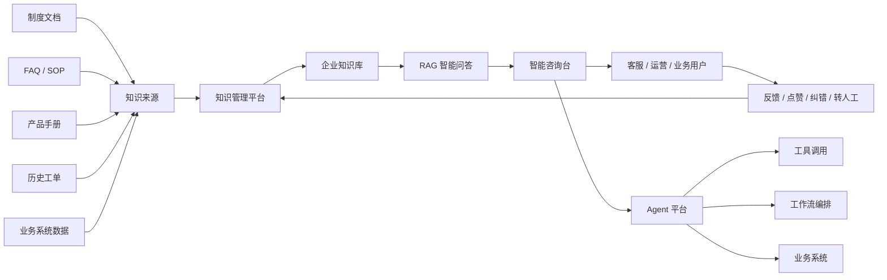

讲解方式：

> 项目从知识来源开始，把制度、FAQ、SOP、产品手册、历史工单和业务系统数据统一接入知识管理平台。经过审核、分类、版本管理和权限控制后进入企业知识库，再通过 RAG 提供智能问答能力。智能咨询台是用户入口，Agent 平台负责复杂任务编排、工具调用和业务系统集成。用户反馈会回流到知识治理和模型优化流程。

---

## 三、总体技术架构

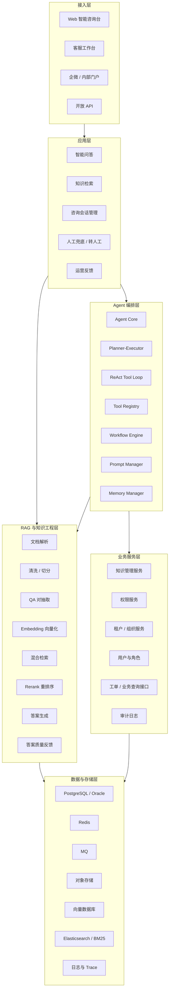

讲解方式：

> 整体架构分为接入层、应用层、Agent 编排层、RAG 与知识工程层、业务服务层和数据存储层。前端通过智能咨询台、客服工作台、门户或 API 接入；应用层处理问答、检索、会话和转人工；Agent 层负责复杂任务拆解、工具调用和工作流；RAG 层负责知识检索和答案生成；业务服务层负责知识管理、权限、租户和审计；底层使用关系型数据库、Redis、MQ、对象存储、向量数据库和检索引擎支撑。

---

## 四、核心技术栈

| 层级 | 技术/组件 | 用途 |
|---|---|---|
| 前端 | Vue / React / 企业内部门户 | 智能咨询台、知识管理后台、运营看板 |
| 后端 | Java、Spring Boot、Spring Cloud、MyBatis、Feign | 业务服务、知识管理、权限、接口集成 |
| AI 服务 | Python、FastAPI、LangChain / LangGraph | RAG、Agent 编排、工具调用、Prompt 管理 |
| 检索 | 向量数据库、Elasticsearch / BM25、Rerank 模型 | 向量检索、关键词检索、混合召回、重排序 |
| 数据 | PostgreSQL、Oracle、Redis、MQ | 元数据、业务数据、缓存、异步任务 |
| 文档处理 | python-docx、PDF 解析、OCR、表格解析 | 多格式知识解析和清洗 |
| 权限安全 | RBAC、多租户隔离、数据权限、审计日志 | 防止越权检索和敏感信息泄露 |
| 观测 | Trace 日志、调用链、错误日志、用户反馈 | 定位召回错误、工具失败、模型幻觉 |

面试注意：

> 如果面试官问具体用什么向量库，不要死磕某一个产品，可以说根据企业环境可选 Milvus、Qdrant、pgvector 或 Elasticsearch Vector，核心不是选型名词，而是要支持向量召回、元数据过滤、权限隔离、增量更新和性能扩展。

---

## 五、知识管理模块技术方案

### 1. 知识生命周期

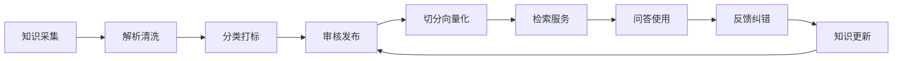

### 2. 关键能力

| 能力 | 技术方案 | 价值 |
|---|---|---|
| 知识采集 | 支持 Word、PDF、Excel、网页、FAQ、历史工单、接口数据 | 打通分散知识来源 |
| 文档解析 | 文本抽取、表格解析、OCR、标题层级识别 | 保留文档结构和语义 |
| 分类打标 | 按业务线、产品、场景、租户、权限、有效期打标签 | 支撑精准检索和权限过滤 |
| 审核发布 | 草稿、审核、发布、下线、版本管理 | 保证知识可信 |
| 权限控制 | 知识库级、文档级、段落级、角色级权限 | 防止越权回答 |
| 版本管理 | 记录历史版本、变更人、变更原因 | 方便追溯和审计 |
| 运营反馈 | 点赞、点踩、纠错、未命中问题、转人工原因 | 持续优化知识质量 |

面试表达：

> 知识管理不是简单上传文档，而是要把知识从采集、审核、发布、检索、使用到反馈形成闭环。尤其企业场景里，知识的有效期、权限、版本和审核流程非常关键，否则大模型很容易基于过期或无权限知识回答。

---

## 六、企业知识库与 RAG 技术方案

### 1. RAG 处理流程

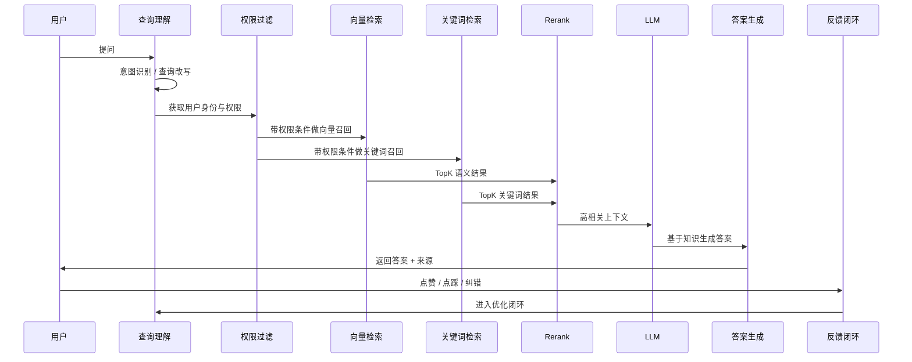

### 2. 技术链路

| 环节 | 技术方案 | 注意点 |
|---|---|---|
| 文档解析 | PDF/Word/Excel/HTML 解析，OCR 辅助 | 保留标题、表格、章节结构 |
| 文本切分 | 按标题、段落、语义、Token 长度混合切分 | 避免切碎业务语义 |
| QA 对抽取 | 从制度、FAQ、SOP 中生成标准问答对 | 提升高频问题命中率 |
| 向量化 | Embedding 模型生成向量 | 支持中英文、领域术语 |
| 向量存储 | Milvus / Qdrant / pgvector / ES Vector | 支持元数据过滤和增量更新 |
| 混合检索 | 向量检索 + BM25 关键词检索 | 兼顾语义相似和精确关键词 |
| Rerank | 对候选片段重新排序 | 提升上下文相关性 |
| 生成答案 | LLM 基于召回内容回答 | 要求引用来源、禁止无依据回答 |
| 质量反馈 | 未命中、低置信度、人工纠错 | 进入知识更新和 Prompt 优化 |

### 3. RAG 架构图

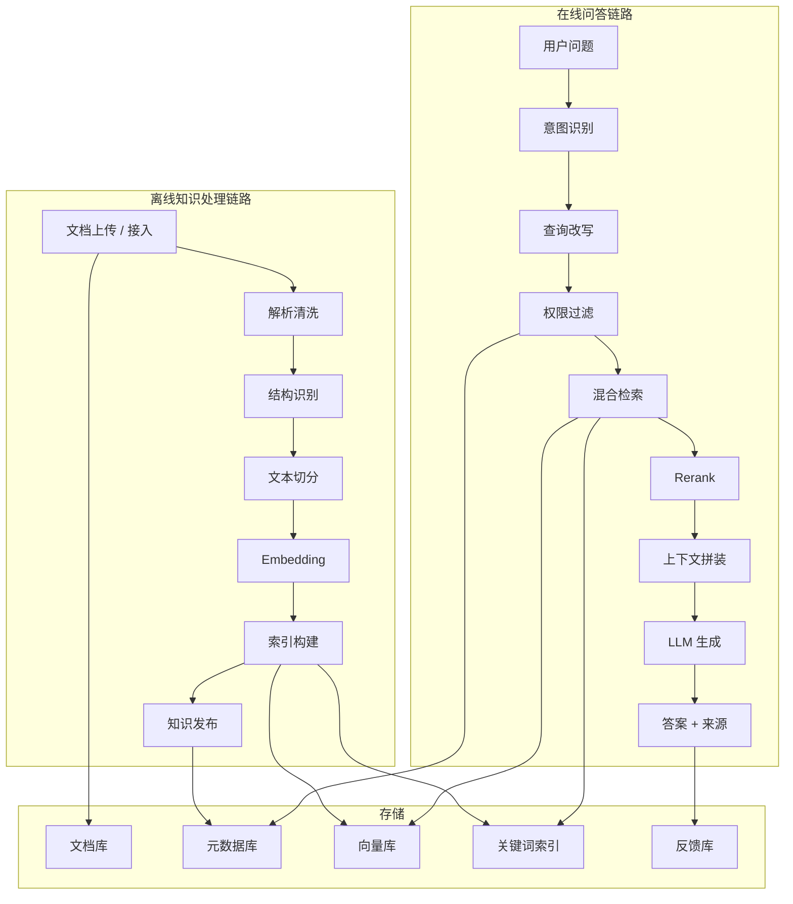

面试表达：

> RAG 的难点不是“能不能查出来”，而是召回是否准确、知识是否有权限、答案是否有来源、低置信度是否兜底、上线后能不能持续优化。

---

## 七、智能咨询台技术方案

### 1. 智能咨询台定位

智能咨询台是用户使用 AI 能力的入口，面向客服、运营、业务人员或内部员工，提供：

- 智能问答
- 知识检索
- 多轮咨询
- 推荐相似问题
- 工单辅助
- 人工转接
- 反馈纠错
- 会话记录与质检

### 2. 智能咨询台业务流程

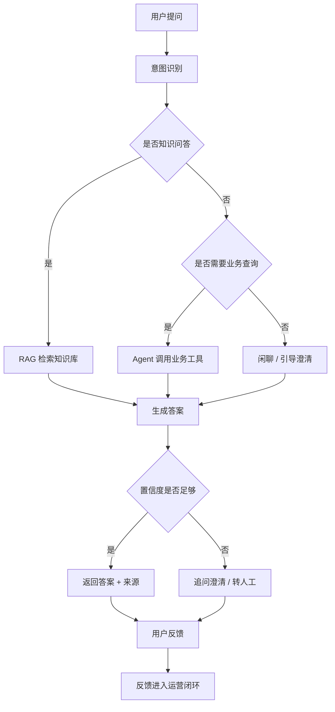

### 3. 智能咨询台关键能力

| 能力 | 技术方案 | 价值 |
|---|---|---|
| 多轮会话 | Session + Conversation Memory | 保持上下文连续 |
| 意图识别 | LLM 分类 / 规则兜底 | 判断问答、查询、投诉、转人工 |
| 智能推荐 | 相似问题推荐、热门知识推荐 | 降低用户提问成本 |
| 人工兜底 | 低置信度、敏感问题、工具失败转人工 | 控制 AI 风险 |
| 答案来源 | 返回知识来源、文档标题、更新时间 | 提升可信度 |
| 反馈闭环 | 点赞、点踩、纠错、未解决原因 | 支撑持续优化 |
| 质检分析 | 会话日志、命中率、满意度、转人工率 | 支撑运营管理 |

面试表达：

> 智能咨询台不是简单聊天窗口，而是 AI 能力的业务入口。它要同时处理用户体验、知识召回、低置信度兜底、人工转接和运营反馈。真正落地时，运营指标比模型演示更重要，比如命中率、转人工率、满意度和平均处理时长。

---

## 八、Agent 平台技术方案

### 1. Agent 平台定位

Agent 平台用于把“问答”升级为“可执行任务”的智能服务能力。

它具备：

- Agent 配置
- Prompt 模板管理
- 工具注册
- Function Calling / Tool Use
- ReAct 推理-行动循环
- Planner-Executor 任务拆解
- 工作流配置
- 多轮上下文记忆
- 失败回退
- 日志追踪
- 人工审批

### 2. Agent 架构图

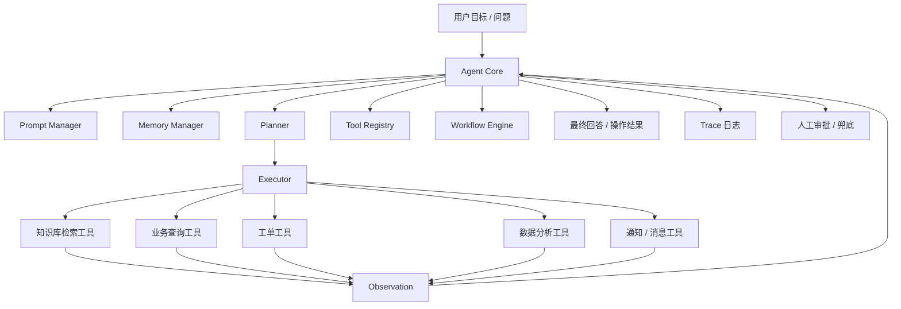

### 3. ReAct 模式

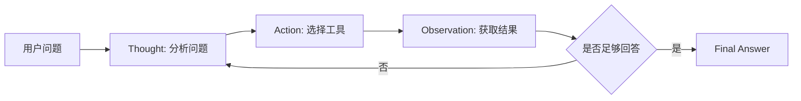

面试解释：

> ReAct 是让 Agent 边想边做。比如用户问某个业务状态，Agent 先判断需要查询知识库还是业务系统，再调用工具，拿到结果后继续判断是否能回答。如果信息不足，就继续追问或转人工。

### 4. Planner-Executor 模式

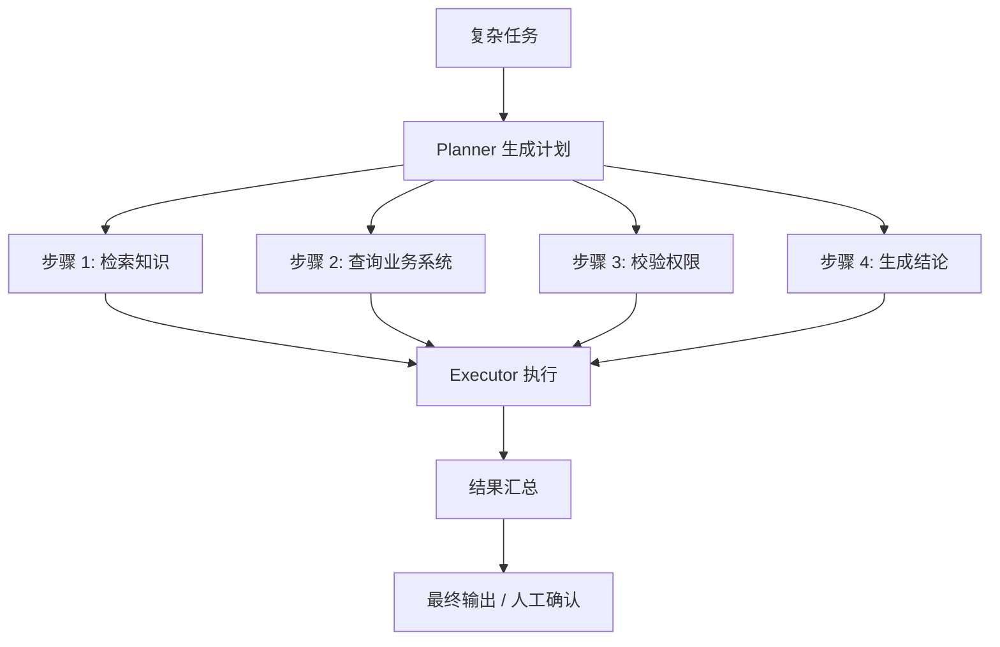

面试解释：

> Planner-Executor 适合复杂任务，先拆计划，再分步执行。相比直接让大模型一次性回答，这种方式更可控，也更方便插入权限校验、人工审批和失败回退。

### 5. Agent 关键技术点

| 技术点 | 方案 | 解决的问题 |
|---|---|---|
| Prompt Manager | 系统 Prompt、场景 Prompt、工具说明、输出格式模板 | 保证输出稳定 |
| Tool Registry | 工具注册、参数 Schema、权限配置 | 控制工具调用边界 |
| Function Calling | 结构化参数调用业务接口 | 避免自然语言误操作 |
| Memory Manager | 短期会话记忆 + 长期知识记忆 | 支持多轮任务 |
| ReAct | 推理、行动、观察循环 | 适合动态探索 |
| Planner-Executor | 计划拆解 + 分步执行 | 适合复杂任务 |
| Workflow Engine | 可视化流程配置 | 降低业务配置门槛 |
| Trace 日志 | 记录推理、工具、参数、结果、耗时 | 方便审计和排障 |
| 失败回退 | 超时、重试、转人工、降级 | 提升稳定性 |
| 人工审批 | 敏感操作、低置信度、外部动作需确认 | 控制生产风险 |

---

## 九、平台核心数据模型

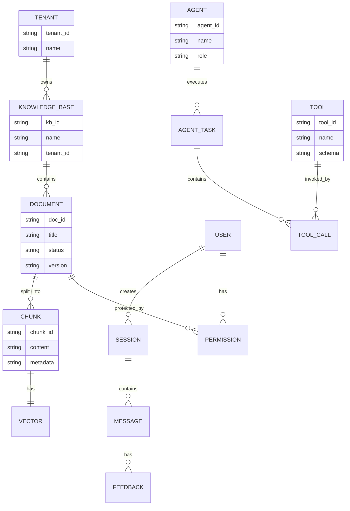

面试表达：

> 企业知识库和 Agent 平台不能只靠文档和向量，还要有完整的数据模型，包括租户、知识库、文档、切片、向量、用户、会话、反馈、Agent、工具调用和权限。这样才能支撑权限隔离、审计追踪和持续运营。

---

## 十、权限与安全方案

### 1. 权限分层

| 层级 | 控制点 |
|---|---|
| 租户级 | 不同 BU / 部门 / 客户知识隔离 |
| 知识库级 | 用户能访问哪些知识库 |
| 文档级 | 文档查看、编辑、发布权限 |
| 段落级 | 敏感片段过滤 |
| 工具级 | Agent 能调用哪些业务接口 |
| 操作级 | 查询、修改、审批、导出、删除 |

### 2. 安全架构

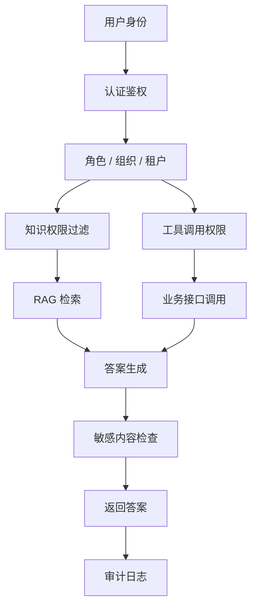

面试表达：

> 权限必须前置到检索阶段，而不是答案生成后再过滤。否则模型可能已经看到了无权限知识。工具调用也一样，Agent 能不能调接口、能查哪些字段、是否需要人工审批，都要在 Tool Registry 和权限服务里控制。

---

## 十一、质量评估与运营闭环

### 1. 指标体系

| 类型 | 指标 |
|---|---|
| 检索指标 | Hit Rate、Recall@K、MRR、Rerank 后命中率 |
| 生成指标 | 答案准确率、引用完整率、幻觉率、拒答正确率 |
| 业务指标 | 平均响应时长、人工转接率、用户满意度、问题解决率 |
| 运营指标 | 未命中问题数、知识更新频率、反馈处理时长 |
| 稳定性指标 | 工具调用成功率、超时率、失败回退率、Trace 完整率 |

### 2. 反馈闭环

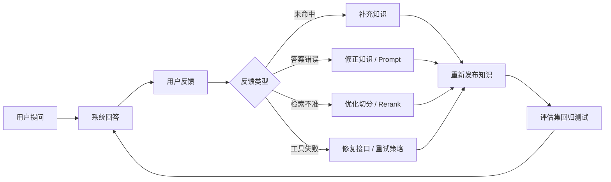

面试表达：

> AI 知识库上线后必须持续运营。错误答案、未命中问题、转人工原因、用户点踩都要进入闭环，分别判断是知识缺失、切分问题、检索问题、Prompt 问题还是工具调用问题。

---

## 十二、部署与集成方案

### 1. 部署架构

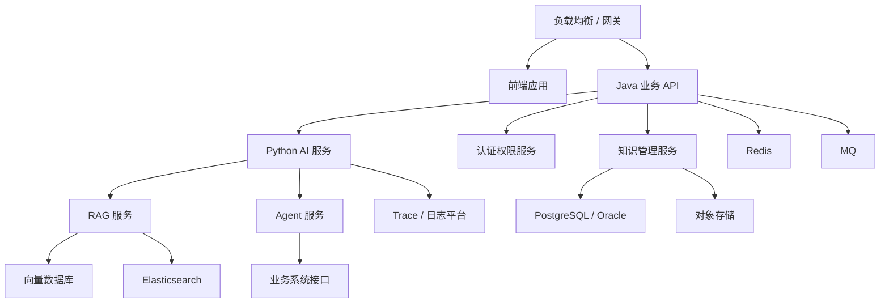

### 2. 集成方式

| 集成对象 | 方式 |
|---|---|
| 内部门户 | SSO / OAuth / LDAP |
| 客服系统 | API / iframe / SDK |
| 工单系统 | REST API / 消息队列 |
| 业务系统 | Tool API / Function Calling |
| 文档系统 | 文件上传 / 定时同步 / API 拉取 |
| 日志平台 | Trace ID / 调用链 / 审计日志 |

---

## 十三、项目难点与解决方案

| 难点 | 具体表现 | 解决方案 |
|---|---|---|
| 知识分散 | 文档格式多、版本乱、无统一入口 | 统一知识采集、审核、发布和版本管理 |
| 召回不准 | 语义相近但业务不对 | 混合检索 + Rerank + 元数据过滤 |
| 权限复杂 | 不同 BU、角色、文档权限不同 | 多租户 + 文档级权限 + 检索前过滤 |
| 答案幻觉 | 模型基于不完整知识发挥 | 来源引用、低置信度拒答、人工兜底 |
| 工具调用失败 | 接口超时、参数错误、权限不足 | Tool Schema、超时、重试、失败回退 |
| 运营难 | 上线后知识没人维护 | 反馈闭环、运营看板、知识责任人 |
| 验收难 | AI 效果不好量化 | 技术指标 + 业务指标 + UAT 问答集 |

---

## 十四、面试时的项目讲法

### 1. 一分钟讲法

> 这个项目是企业级知识管理与智能服务平台，目标是解决集团内部知识分散、客服咨询入口多、知识利用率低的问题。技术上我们建设了知识管理、企业知识库、RAG 智能问答、智能咨询台和 Agent 平台。知识管理负责采集、审核、版本、权限和发布；RAG 负责文本切分、向量化、混合检索、Rerank 和答案生成；智能咨询台负责用户问答、人工兜底和反馈；Agent 平台负责复杂任务编排、工具调用和工作流配置。项目重点不是简单接大模型，而是让知识更新、召回质量、权限隔离、答案可信和运营反馈都能持续维护。

### 2. 三分钟讲法

> 项目背景是集团内部知识分散，客服和业务人员查知识效率低，知识更新和权限管理也不统一。我们建设了一个统一知识管理和智能咨询平台。  
>
> 第一层是知识管理，支持文档接入、解析清洗、分类打标、审核发布、版本管理和权限控制。  
>
> 第二层是企业知识库和 RAG，核心链路包括文本切分、QA 对抽取、Embedding 向量化、向量检索、BM25 关键词检索、混合召回、Rerank、上下文拼装和大模型生成。  
>
> 第三层是智能咨询台，面向客服、运营和业务用户，提供智能问答、多轮咨询、答案来源、转人工和反馈纠错。  
>
> 第四层是 Agent 平台，支持工具注册、Function Calling、ReAct、Planner-Executor、工作流配置、Trace 日志和失败回退。复杂问题不只是回答，还可以检索知识、调用业务接口、生成处理建议或转人工。  
>
> 项目上线后，知识查询响应从平均 30 分钟缩短到 5 分钟内，客服场景 AI 自主解答率达到 76%，人工坐席负载降低约 40%。我的理解是，企业 AI 项目真正难点不只是模型，而是知识治理、权限、召回质量、答案可信、工具边界和持续运营。

---

## 十五、技术面追问速答

### Q1：为什么不用普通全文检索？

> 全文检索适合精确关键词，但用户提问经常是自然语言，表达和文档用词不一致。向量检索能解决语义相似问题，但也可能召回不够精确。所以我们采用混合检索：向量检索负责语义召回，BM25 负责关键词精确匹配，再用 Rerank 提升排序质量。

### Q2：RAG 如何处理权限？

> 权限必须在检索前处理。用户提问后先获取租户、组织、角色和知识库权限，再带着权限条件进行向量检索和关键词检索。不能先全库召回再让模型过滤，否则会有越权风险。

### Q3：如何减少幻觉？

> 主要靠五点：基于召回知识回答、答案带来源、低置信度拒答或转人工、Prompt 限制不得编造、用户反馈进入知识和检索优化闭环。

### Q4：Agent 如何避免乱调用工具？

> 工具必须注册在 Tool Registry 中，定义参数 Schema、权限、超时、重试、审批规则和日志。Agent 只能调用授权工具，敏感操作必须人工确认。

### Q5：ReAct 和 Planner-Executor 区别？

> ReAct 更像边想边做，适合动态探索；Planner-Executor 是先拆计划再分步执行，适合复杂但流程可拆的任务。企业项目里可以结合使用。

### Q6：智能咨询台如何验收？

> 除了功能验收，还要看问答命中率、答案准确率、平均响应时间、人工转接率、用户满意度、权限隔离、日志追踪和反馈闭环。

---

## 十六、简历可对应关键词

可以在面试中自然提到：

- 知识管理
- 企业知识库
- RAG
- 文本切分
- QA 对抽取
- Embedding
- 向量数据库
- 混合检索
- BM25
- Rerank
- 多租户
- 权限隔离
- 智能咨询台
- 多轮会话
- 人工兜底
- Agent
- Tool Use
- Function Calling
- ReAct
- Planner-Executor
- Prompt Manager
- Memory Manager
- Tool Registry
- Workflow Engine
- Trace 日志
- 质量反馈闭环

