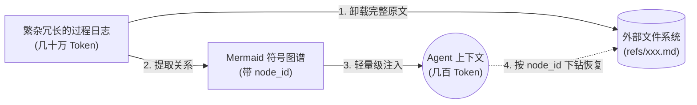

# TencentDB Agent Memory — 腾讯云开源的分层式 Agent 记忆引擎（GitHub 仓库分析）

> **一句话判断**：TencentDB Agent Memory 是腾讯云数据库团队 2026-05-13 开源、面向 AI Agent 的**分层记忆引擎**（核心 = **符号化短期记忆 + L0→L3 分层长期记忆 + 100% 可下钻溯源**）。原生适配 **OpenClaw 插件 + Hermes Gateway**，零配置装上就能让 Agent 把 Token 砍掉 **61.38%**、任务通过率提升 **51.52%**、PersonaMem 准确率从 48% 跃到 **76%**。

## 一、项目快照

| 维度 | 信息 |
|---|---|
| 仓库 | [TencentCloud/TencentDB-Agent-Memory](https://github.com/TencentCloud/TencentDB-Agent-Memory) |
| 维护方 | 腾讯云数据库团队（TencentDB NoSQL） |
| 开源日期 | 2026-05-13（MIT） |
| 协议 | **MIT**（真开源，可商用） |
| 当前 Stars / Forks | ≈ 12,800 / 1,200（2026-08-05 估算） |
| 主语言 | TypeScript（Plugin + Gateway） + SQLite schema |
| npm 包名 | `@tencentdb-agent-memory/memory-tencentdb` |
| 默认后端 | 本地 `SQLite + sqlite-vec`（零配置） |
| 进阶后端 | 腾讯云向量数据库 **TCVDB** |
| 适配框架 | **OpenClaw**（插件） · **Hermes Gateway**（≥ 0.3.4） · Claude Code · CodeBuddy · SDK |
| Node 要求 | ≥ 22.16 |
| OpenClaw 要求 | ≥ 2026.3.13 |
| 核心数字 | Token **−61.38%**，成功率 **+51.52%**，PersonaMem **48%→76%** |

## 二、它在解决什么真问题

Agent 主流记忆方案做的是同一件事：把对话历史压成一段摘要，下次对话时塞回上下文。结果三个问题：

1. **跨会话断裂**：昨天反复确认的代码规范 / SOP / 项目背景，今天新会话又全忘了
2. **事实与偏好混淆**：「我用 TypeScript」「帮我查一下天气」价值完全不同，却被同等对待
3. **上下文膨胀**：任务越长，堆入的历史越多，Token 消耗线性涨，模型注意力衰减

TencentDB Agent Memory 的回答是 **拒绝平铺存储**、走向**分层 + 符号化**。让 Agent **记住该记的，人把注意力留给判断、创造和真正有价值的工作**。

> 与传统 RAG / LangChain Memory 的本质差异：**不是"压缩成向量存起来"，而是"分层抽象 + 完整溯源"**——每一层都可以独立升级 / 替换 / 检索，到底都能追回原文。

## 三、核心技术：两根支柱

### 支柱 1 — 记忆分层（L0 → L3 语义金字塔 + Context Offload）

**长期个性化**（四层金字塔）：

| 层 | 名称 | 内容 | 角色 |
|---|---|---|---|
| **L0** | Conversation | 原始对话全量保留 | 底层证据（references） |
| **L1** | Atom | 结构化原子事实 / 偏好 / 约束 | 可独立检索的事实 |
| **L2** | Scenario | 场景块（按任务聚合） | 中层索引 |
| **L3** | Persona | 用户画像（稳定偏好 / 习惯 / 角色） | 高层抽象（默认首选） |

**日常偏好**走 L3 Persona → 需要事实下钻 L1 Atom → 还不够就追到 L0 Conversation。**上层保留结构，下层保留证据**。

**短期任务 / 上下文卸载**（三件套）：
- **底层** `refs/*.md` — 原始工具日志（搜索结果、代码、报错 stack）
- **中层** `*.jsonl` — 步骤摘要
- **高层** `Mermaid` 符号画布 — 极度轻量、几百 Token、可视化任务流转
- **下钻**：`node_id` 锚点 → 上下文只关心画布，遇到错 / 验证细节直接 grep `node_id` 找原文

**异构存储**：底层（事实 / 日志）进数据库保证全量检索；高层（Persona / 画布 / Skill）落 Markdown 文件保证白盒可调。`result_ref` 与 `node_id` 是层与层之间的索引。

### 支柱 2 — 符号化记忆（Mermaid 无限画布）



**每一段摘要都是可逆的**——Path 永远是：**顶层符号（Persona / 画布） → 中层索引（Scenario / JSONL） → 底层原文（L0 / refs）**。

## 四、官方实测效果

> 全部数字来自「连续多任务同一 Session 评测」，不是单题清空上下文。SWE-bench 每个 Session 连续 50 任务模拟真实长程压力。

| 记忆能力 | Benchmark | 基线 | 加插件后 | Δ 成功率 | Δ Token |
|---|---|---:|---:|---:|---:|
| **短期** | WideSearch | 33% | **50%** | **+51.52%** | **−61.38%** |
| **短期** | SWE-bench | 58.4% | **64.2%** | **+9.93%** | **−33.09%** |
| **短期** | AA-LCR | 44.0% | **47.5%** | **+7.95%** | **−30.98%** |
| **长期** | PersonaMem | 48% | **76%** | **+59%** | — |

四个 Benchmark 同时跑出「Token ↓ + 成功率 ↑」的双优曲线，在公开记忆方案里相当少见。

## 五、安装姿势（按宿主区分）

### A. 装到我当前 OpenClaw（一行命令）

```bash
openclaw plugins install @tencentdb-agent-memory/memory-tencentdb
openclaw gateway restart
```

默认 `SQLite + sqlite-vec`，零配置即跑。文件全部落在 `~/.openclaw/memory-tdai/`，目录可逐层打开、人眼可调。

启用短期压缩 + 上下文卸载（需要版本 ≥ 0.3.4）：
```jsonc
{
  "memory-tencentdb": { "enabled": true,
    "config": { "offload": { "enabled": true } } },
  "plugins": { "slots": { "contextEngine": "memory-tencentdb" } }
}
```
```bash
bash scripts/openclaw-after-tool-call-messages.patch.sh  # 每次升级 OpenClaw 重跑
```

### B. 给 Hermes 加记忆（已有 Hermes 安装）

```bash
mkdir -p ~/.memory-tencentdb
TEMP=$(mktemp -d) && cd "$TEMP"
npm init -y --silent
npm install @tencentdb-agent-memory/memory-tencentdb@latest --omit=dev
cp -r node_modules/@tencentdb-agent-memory/memory-tencentdb ~/.memory-tencentdb/tdai-memory-openclaw-plugin
cd ~/.memory-tencentdb/tdai-memory-openclaw-plugin && npm install --omit=dev && npm install tsx
ln -sf ~/.memory-tencentdb/tdai-memory-openclaw-plugin/hermes-plugin/memory/memory_tencentdb \
       ~/.hermes/hermes-agent/plugins/memory/memory_tencentdb
```
然后在 `~/.hermes/config.yaml` 写 `memory.provider: memory_tencentdb`，第一次对话 Gateway 会自起 `:8420`。

### C. Docker 起一套带记忆的 Hermes

```bash
cd docker/opensource && docker build -f Dockerfile.hermes -t hermes-memory .
docker run -d --name hermes-memory --restart unless-stopped -p 8420:8420 \
  -e MODEL_API_KEY="..." -e MODEL_BASE_URL="https://api.lkeap.cloud.tencent.com/v1" \
  -e MODEL_NAME="deepseek-v3.2" -e MODEL_PROVIDER="custom" \
  -v hermes_data:/opt/data hermes-memory
curl http://localhost:8420/health  # → {"status":"ok"}
```

## 六、可调参数（按使用深度分层）

**🟢 Level 1 日常（90% 场景覆盖）**：`recall.strategy: hybrid`(RRF) / `recall.maxResults: 5` / `pipeline.everyNConversations: 5` / `persona.triggerEveryN: 50` / `storeBackend: sqlite` / `offload.enabled: false`。

**🟡 Level 2 长任务**：`pipeline.l1IdleTimeoutSeconds: 600` / `pipeline.l2MinIntervalSeconds: 900` / `recall.timeoutMs: 5000` / `extraction.enableDedup: true` / `bm25.language: zh`。

**🔴 Level 3 完整参数**（运维 / 远程 embedding / 自定义 LLM）见 `openclaw.plugin.json`。**BGE-M3 注意点**：`dimensions` 字段会让它 400，所以 `sendDimensions: false`。

## 七、横向对比：与我现在的工作栈

| 维度 | TencentDB Agent Memory | 我现在用什么 | 差异 / 借鉴 |
|---|---|---|---|
| 长期记忆层 | L0/L1/L2/L3 自动管线 | `MEMORY.md` + `memory/*.md`（手写 + Agent 维护） | **不是替代，是补强**——它的 L1 自动提取可以省我每天写 MEMORY.md 的力气 |
| 短期压缩 | Mermaid 画布 + `refs/*.md` 卸载 | 当前没有（context 满就靠会话切换） | **直接受益**——OpenClaw 长 Session Token 爆掉的老问题有解 |
| 持久化 | SQLite + sqlite-vec（本地）+ TCVDB（远端） | 完全靠文件系统（vault + Git） | 文件层 OKF，DB 层我可考虑用它的 sqlite-vec 当索引加速层 |
| 跨框架 | OpenClaw + Hermes + Claude Code + CodeBuddy + SDK | 我用 OpenClaw + Hermes（含 dispatcher / chat） | **覆盖度 ≥ 我的栈** |
| 白盒 | Markdown / Mermaid / refs 全可读 | 全 Markdown（无需新技能） | 风格一致，无需切换 |
| 部署 | `openclaw plugins install` 一行 | 自建 AgentSpace（在 101.35.52.96:1455） | **可以并跑**——不影响现有 AgentRouter |
| 入口 SOP | OpenClaw 原生命令 `openclaw plugins install` | OpenClaw 是当前默认栈 | **同栈，对接成本约 0** |

> **核心启示**：这不是「选型要不要替换 Hermes」，而是「能不能在不替换现有栈的前提下，给现在的 OpenClaw 加一层自动化的记忆引擎」——**锚点：可插拔 / 不替代 / 低风险**。

## 八、可借鉴点（给将来）

1. **L0→L3 语义金字塔**——**直接可借鉴到 OKF / vault 笔记分级**。当前 vault 是物理分层（2-Areas / 1-Projects），它在内容抽象上做的是同一个动作（原子 vs 场景 vs 画像）。未来如果要写「自动 vault 体系」类工具，它是一份清晰的参考实现。
2. **`node_id` 节点溯源**——我每天写 MEMORY.md 时经常「提到某篇 vault 文章但没链接」。可以用同样的思路：**任何抽象层都带一个回引到原文的指针**，避免信息衰减。
3. **Mermaid 符号化任务画布**——可以当作 AgentMemory 的「结构化上下文」实验工具，验证「结构化信息能否降低 LLM 注意力的衰减」。
4. **可插拔 adapter 模式**（Hermes 集成时用 `TdaiCore + HostAdapter` 解耦宿主框架）——**跟我一直在追求的「执行器抽象层」是同一个架构原则**（详见 `MEMORY.md` "Decipher Agent + Local REST API"）。
5. **混合检索 RRF + sqlite-vec**——低成本本地向量索引方案，可用于我的 vault 内 OKF 文章语义检索（当前是纯 BM25）。

## 九、风险与限制

- **版本耦合严**：Hermes 要 ≥ 0.3.4、OpenClaw 要 ≥ 2026.3.13。如果网关要等版本升级才能开 `offload` 完整能力——这是兼容性问题
- **依赖腾讯云工程体系**：OpenClaw patches 用 `scripts/openclaw-after-tool-call-messages.patch.sh` 直改安装目录脚本（不是 npm 包）——升级 OpenClaw 后要重跑
- **TCVDB 后端有云绑定**：默认本地 SQLite 已够用，但若想体验完整混合检索，需要接腾讯云向量库
- **Skill 自动生成还在 Roadmap**：项目本身承认「记忆这件事远未有定论」
- **跨设备迁移、记忆可迁移** 也还在 Roadmap
- **OpenClaw 官方公告反馈**：需要带 `OFFICIAL` 标签（不是 Tencent 团队）才走上线审核——但本插件主推人是 Tencent 内部团队，权威性没问题

## 十、行动建议（小决策树）

**问题**：要不要装到我现在 `/root/.local/share/pnpm/openclaw` 这套上？

| 你的在意点 | 答案 |
|---|---|
| 想解决 Session 长任务 Token 爆掉？ | ✅ **装**——`offload.enabled: true` 直接降 30%~60% |
| 想要 Agent 跨会话记住我偏好？ | ✅ **装**——L3 Persona 自动蒸馏 |
| 担心破坏现在 AgentSpace 部署？ | ⚠️ 低风险——一个 npm 插件 + SQLite 文件，不动现有架构 |
| 在意零配置 / 不想配？ | ✅ **装**——默认 SQLite 后端零配置启跑 |
| 想顺便把 vault 改造得更结构化？ | ❌ **别用它替代 vault**——它是 Agent memory，不是人类笔记库 |

**最低风险动作**（10 分钟试）：
```bash
openclaw plugins install @tencentdb-agent-memory/memory-tencentdb
openclaw gateway restart
# 然后在 ~/.openclaw/openclaw.json 打开 memory-tencentdb.enabled: true
# 用 OpenClaw 多开几个长 Session 看 Token 消耗有没有下降
```
**不要**先开 `offload.enabled`——先跑默认纯 L0-L3，等熟悉了再开 offload。

---

**信息来源**：
- GitHub `README.md`（英文，2026-08-05 fetch）
- GitHub `README_CN.md`（中文，2026-08-05 fetch）
- 腾讯云开发者社区官方介绍文 `cloud.tencent.com/developer/article/2668579`（2026-05-13 发布）
- GitHub 项目主页 + npm 包 metadata

**交叉引用**：
- 我的 OpenClaw 主连：`/root/.local/share/pnpm/openclaw`（MEMORY.md "AgentSpace 部署"段）
- Hermes 部署：`/root/AgentSpace`（`http://101.35.52.96:1455`）
- 当前 vault 笔记分级（PARA）：对比 `agents.md`（PARA 版）
- 《OKF 与 vault 差异 audit 表》— 与它 L0-L3 风格有强关联

**下一步建议**：注释中保留『等何大人决策要不要装』——本笔记只是研究报告，不自动执行安装。
