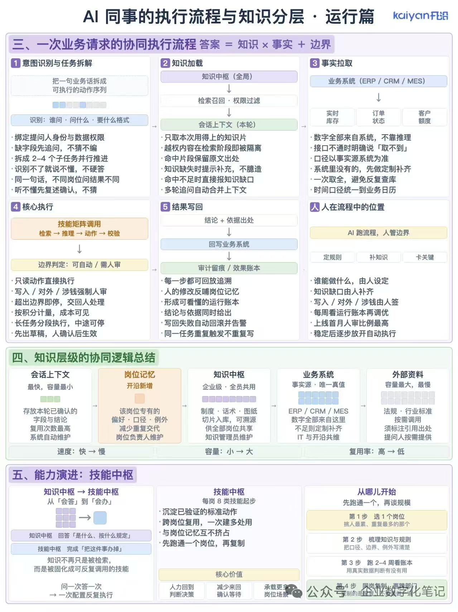

# AI 同事的执行流程与知识分层 · 运行篇

> 来源：公众号「企业数字化笔记」(kaiyan开眼)
> 配图：

## 三、一次业务请求的协同执行流程

**答案 = 知识 × 事实 + 边界**

### 1. 意图识别与任务拆解

- 把一句业务话拆成可执行的动作序列
- 识别：谁问·问什么·要什么格式
- 绑定提问人身份与数据权限
- 缺字段先追问，不猜不编
- 拆成 2-4 个子任务并行推进
- 识别不了就说不懂，不硬答
- 同一句话，不同岗位问结果不同
- 听不懂先复述确认，不猜

### 2. 知识加载

- **知识中枢（全局）** → 检索召回·权限过滤 → **会话上下文（本轮）**
- 只取本次用得上的知识片
- 越权内容在检索阶段即被隔离
- 命中片段保留原文出处
- 知识缺失时提示补充，不臆造
- 命中不足时直接报知识缺口
- 多轮追问自动合并上下文

### 3. 事实拉取

- 业务系统（ERP / CRM / MES）
- 实时库存、订单状态、客户额度
- 数字全部来自系统，不靠推理
- 接口不通时明确说「取不到」
- 口径以事实源系统为准
- 系统里没有的，先做定制补齐
- 一次取全，避免反复查库
- 时间口径统一到业务日历

### 4. 核心执行

- **技能矩阵调用**：检索→推理→动作→校验
- **边界判定**：可自动/需人审
- 只读动作直接执行
- 写入/对外/涉钱强制人审
- 超出边界即停，交回人处理
- 按积分计量，成本可见
- 长任务分段执行，中途可停
- 先出草稿，人确认后生效

### 5. 结果写回

- 结论+依据出处 → 回写业务系统 → 审计留痕/效果账本
- 每一步都可回放追溯
- 人的修改反哺岗位记忆
- 形成可看懂的本轮账本
- 结论与依据同时给出
- 写回失败自动回滚并告警
- 同一任务重复触发不重复写

### 人在流程中的位置

- **AI 跑流程，人管边界**
- 定规则、补知识、卡关键
- 谁能做什么，由人设定
- 知识缺口由人补齐
- 写入/对外/涉钱由人签
- 每周看运行账本再调优
- 上线首月人审比例最高
- 稳定后逐步放开自动执行

## 四、知识层级的协同逻辑总结

| 会话上下文 | 岗位记忆 | 知识中枢 | 业务系统 | 外部资料 |
|---|---|---|---|---|
| 最快，容量最小 | 开沿新增 | 企业级·全员共用 | 事实源·唯一真值 | 容量最大，最慢 |
| 存放本轮已确认的字段与结论 | 该岗位专有的偏好·口径·例外 | 制度·话术·图纸切片入库，可溯源 | ERP/CRM/MES 数字全部来自这里 | 法规·行业标准按需调用 |
| 复用次数最高 | 减少重复交代 | 供全部岗位共享 | 不足则定制补齐 | 须标注引用出处 |
| 系统自动维护 | 岗位负责人维护 | 知识管理员维护 | IT 与开沿共维 | 提问人按需提供 |

**速度：快→慢　容量：小→大　复用率：高→低**

## 五、能力演进：技能中枢

### 知识中枢 → 技能中枢：从「会答」到「会办」

- 知识中枢：回答「是什么、按什么规定」
- 技能中枢：完成「把这件事办掉」
- 知识不再只是被检索，而是被固化成可反复调用的技能
- 问一次答一次 → 一次配置反复执行

### 技能中枢

每岗 8 类技能起步
- 沉淀已验证的标准动作
- 跨岗位复用，一次建多处用
- 与岗位记忆互不挤占
- 先跑通一个岗位，再复制

**核心价值**
- 人力回到判断决策
- 减少来回确认等待
- 承载更多岗位场景

### 从哪儿开始：先跑通一个，再谈规模

- **第 1 步**：选 1 个岗位（挑人最累、重复最多的那个）
- **第 2 步**：梳理知识与规则（把口径、边界、例外写清楚）
- **第 3 步**：跑 2-4 周看账本（用真实数据判断有没有用）
- **第 4 步**：风险靠别上、人手举自门（复制稳定后转推）

## 核心洞察（个人提炼）

1. **答案 = 知识 × 事实 + 边界**——把"知识"和"事实"分开存储，"边界"独立判定（人审/自动），这是企业 AI 落地的关键架构原则。
2. **5 层知识体系**：会话上下文（最快最小）→ 岗位记忆（个性化）→ 知识中枢（全员共用）→ 业务系统（事实源）→ 外部资料（按需调用）。**速度/容量/复用率**呈反向分布。
3. **从「会答」到「会办」**：知识中枢只能回答问题，技能中枢才能完成任务——后者才是真正的 Agent 价值。
4. **人在边界**：写入/对外/涉钱强制人审，定规则、补知识、卡关键——这跟"Agent + 人类监督"的经典框架一致。
5. **落地路径**：先跑通 1 个岗位（挑人最累的）→ 2-4 周看账本 → 复制扩展。这是 MVP 思维，不是技术炫技。

## 与德勤 AI Native 项目的关联

- **执行器抽象层**：5 个流程步骤（意图识别→知识加载→事实拉取→核心执行→结果写回）刚好可以作为 Agent 执行器的能力分层
- **技能中枢**：直接对应德勤 MVP 的 Agent Skills 体系，每岗 8 类技能起步 → 可以拆出"通用技能 + 岗位技能"
- **知识中枢 + 岗位记忆**：这就是 RAG + Few-shot 的工程化实现
- **人在流程中的位置**：写入/对外/涉钱强制人审 → 这就是 AgentRouter 里"风险等级路由"的业务规则
- **先跑通一个**：第 1 步选岗的方法论，可直接套用到德勤 MVP 的"先做哪个场景"