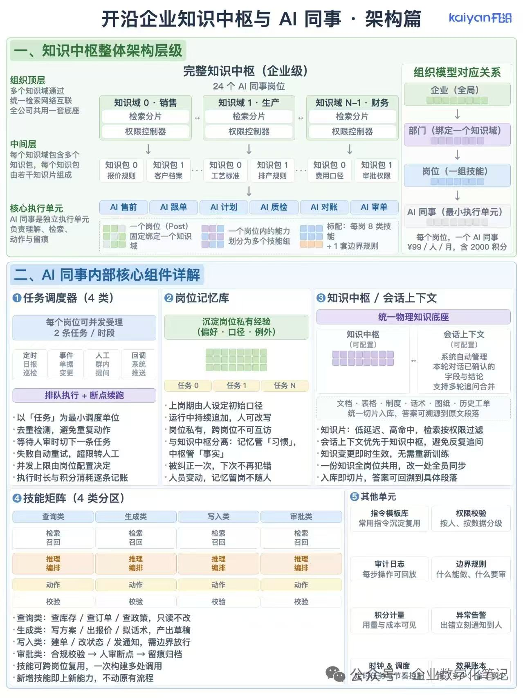

# 开沿企业知识中枢与 AI 同事 · 架构篇

> 来源：公众号「企业数字化笔记 / 小节奏」(kaiyan开眼)
> 姊妹篇：[[2026-08-15 - AI 同事的执行流程与知识分层 · 运行篇]]
> 配图：

## 一、知识中枢整体架构层级

### 层级定义

- **组织顶层**：多个知识域通过统一检索网络互联，全公司共用一套底座
- **中间层**：每个知识域包含多个知识包，每个知识包由若干知识片段组成
- **核心执行单元**：AI 同事是独立执行单元，负责理解、检索、动作与留痕

### 知识中枢层级结构（4 层模型）

```
┌─────────────────────────────────────────────┐
│  知识域层（横向互联）                        │
│  销售域  ↔  生产域  ↔  ...  ↔  财务域       │
│  (检索分片 + 权限控制器)                     │
└──────────────┬──────────────────────────────┘
               ↓
┌─────────────────────────────────────────────┐
│  知识包层                                    │
│  销售域 → 报价规则 / 客户档案                │
│  生产域 → 工艺标准 / 排产规则                │
│  财务域 → 费用口径 / 审批权限                │
└──────────────┬──────────────────────────────┘
               ↓
┌─────────────────────────────────────────────┐
│  AI 同事岗位层（每岗固定绑定一个知识域）      │
│  AI 售前 / AI 跟单 / AI 计划 / AI 质检       │
│  AI 对账 / AI 审单 ...                       │
│  标配：每岗 8 类技能 + 1 套边界规则           │
└─────────────────────────────────────────────┘
```

### 组织模型对应关系（4 级映射）

| 组织层级 | 架构对应 | 职责 |
|---|---|---|
| **企业（全局）** | 顶层 | 全公司共用一套底座 |
| ↓ | ↓ | ↓ |
| **部门** | 中间层（绑定一个知识域）| 销售/生产/财务等部门知识库 |
| ↓ | ↓ | ↓ |
| **岗位** | 执行层（一组技能）| 售前/跟单/计划/质检等岗位 |
| ↓ | ↓ | ↓ |
| **AI 同事** | 最小执行单元 | ¥99/人/月，含 2000 积分 |

> **核心约束**：一个岗位（Post）固定绑定一个知识域；一个岗位内的能力划分为多个技能组。

---

## 二、AI 同事内部核心组件详解（5 大块）

### ① 任务调度器（4 类触发）

**并发上限**：每个岗位可并发受理 **2 条任务 / 时段**

**4 类触发方式**：

| 触发类型 | 场景 | 示例 |
|---|---|---|
| **定时** | 周期性任务 | 日报巡检 |
| **事件** | 业务变更触发 | 单据变更 |
| **人工** | 主动询问 | 群内提问 |
| **回调** | 系统推送 | 外部 API 回调 |

**执行机制**：排队执行 + 断点续跑

**关键特征**：
- 以「任务」为最小调度单位
- 去重检测，避免重复动作
- 等待人审时切下一条任务（不阻塞调度器）
- 失败自动重试，超限转人
- 并发上限由岗位配置决定
- 执行时长与积分消耗逐条记账

### ② 岗位记忆库

**职责**：沉淀岗位私有经验（偏好 · 口径 · 例外）

**特征**：
- 上岗期由人设定初始口径
- 运行中持续追加，人可改写
- **岗位私有，跨岗位不可互访**
- **与知识中枢分离**：记忆管「习惯」，中枢管「事实」
- 被纠正一次，下次不再犯错（增量学习）
- 人员变动，记忆留岗不随人

### ③ 知识中枢 / 会话上下文

**职责**：统一物理知识底座

```
知识中枢（可配置）  ↔  会话上下文（可配置）
  - 基础知识存储        - 本轮对话已确认字段
  - 长期持久化           - 系统自动管理
                         - 支持多轮追问合并
```

**数据来源**：文档 · 表格 · 制度 · 话术 · 图纸 · 历史工单
**切片策略**：统一切片入库，答案可溯源到原文段落

**关键特征**：
- 知识片：低延迟、高命中，检索按权限过滤
- **会话上下文优先于知识中枢**，避免反复追问
- 知识变更即时生效，无需重新训练
- 一份知识全岗位共用，改一处全员同步
- 入库即切片，答案可回溯到具体段落

### ④ 技能矩阵（4 类分区）

**4 类技能**：

| 类型 | 用途 | 风险等级 | 示例 |
|---|---|---|---|
| **查询类** | 只读不改 | 低（自动）| 查库存 / 查订单 / 查政策 |
| **生成类** | 产出草稿 | 中（草稿确认）| 写方案 / 出报价 / 拟话术 |
| **写入类** | 改业务状态 | 高（人审）| 建单 / 改状态 / 发通知 |
| **审批类** | 合规校验 | 高（强制人审）| 合规校验 → 人审断点 → 留痕归档 |

**技能调用链**：检索召回 → 推理编排 → 动作 → 校验

**关键特征**：
- 技能可跨岗位复用，一次构建多处调用
- 新增技能即上新能力，不动原有流程

### ⑤ 其他单元（6 个辅助模块）

1. **指令模板库** — 常用指令沉淀复用
2. **权限校验** — 按人、按数据分级
3. **审计日志** — 每步操作可回放
4. **边界规则** — 什么能做、什么要审
5. **积分计量** — 用量与成本可见
6. **异常告警** — 出错立刻通知到人

**底部横条**：时钟 & 调度 + 效果账本

---

## 核心洞察（个人提炼）

### 1. 「企业-部门-岗位-AI同事」4 级映射 = 组织架构的数字化镜像

这不是技术架构，是**组织架构的 1:1 数字孪生**。每个 AI 同事绑定一个岗位、每个岗位绑定一个知识域、每个知识域对应一个部门——这是企业 AI 落地的**天然边界**。

### 2. 「技能矩阵 4 类分区」= 按风险等级分类

| 风险 | 类型 | 决策 |
|---|---|---|
| 低 | 查询 | 自动 |
| 中 | 生成 | 草稿确认 |
| 高 | 写入 | 人审 |
| 高 | 审批 | 强制人审 |

**这跟 AgentRouter 的风险等级路由完全对应**。

### 3. 「岗位记忆 ≠ 知识中枢」是关键架构分离

- 知识中枢：制度/话术/图纸（事实，跨岗位共享）
- 岗位记忆：偏好/口径/例外（习惯，岗位私有）

**两者不能混在一起**：记忆会污染知识检索，知识更新会影响个性化。

### 4. 「任务调度器 4 类触发」= 异步事件驱动架构

定时 / 事件 / 人工 / 回调 → 这本质上是**事件总线 + 任务队列**的组合。配合「并发上限 2 条 / 岗位」+「去重检测」+「断点续跑」——就是一套**企业级 Agent 调度系统**。

### 5. 商业模型：「¥99 / 人 / 月 + 2000 积分」

SaaS 化定价：基础订阅费 + 用量计费。这是**企业 AI 落地的标准商业模式**——**降低决策门槛 + 控制用量成本**。

---

## 与德勤 AI Native 项目的关联（深度对照）

### 架构层映射

| 开沿架构 | 德勤 MVP 对应 | 状态 |
|---|---|---|
| **企业级知识中枢** | 企业知识库 + RAG | ✅ 已有基础 |
| **知识域横向互联** | 多业务域统一检索 | 待实现 |
| **岗位记忆库** | Agent Few-shot 个性化 | 部分实现 |
| **技能矩阵 4 类** | Agent Skills 体系 | ⚠️ 需补充审批类 |
| **任务调度器** | AgentRouter 调度 | ✅ 有雏形 |
| **人审断点** | 风险等级路由 | ⚠️ 规则待细化 |
| **积分计量** | 成本/账本系统 | 待实现 |
| **效果账本** | Agent 运行仪表盘 | 部分实现 |

### MVP 落地建议（按开沿架构）

1. **第一步**：明确 4 级组织映射（企业→部门→岗位→AI 同事）
   - 德勤 MVP 建议：先定义"咨询部-顾问岗-AI 顾问"的层级
2. **第二步**：搭知识中枢 + 知识域
   - 不要做「一个全局知识库」，按业务域拆分
3. **第三步**：每岗 8 类技能起步
   - 其中 4 类是基础设施（查询/生成/写入/审批）
   - 另 4 类是岗位专属
4. **第四步**：调度器并发上限设为 2 条 / 岗位（不要贪多）
5. **第五步**：先跑 1 个岗位 2-4 周，看效果账本

### 关键提醒

开沿架构的成功前提：**「知识变更即时生效，无需重新训练」**——这是 RAG 而非 Fine-tuning 的核心优势。德勤 MVP 必须坚持**纯 RAG 路线**，不要走模型微调（成本高、迭代慢、与"即时生效"的目标冲突）。

---

## 相关链接

- 姊妹篇：[[2026-08-15 - AI 同事的执行流程与知识分层 · 运行篇]]
- 德勤项目：`/root/vault/1-Projects/德勤/`
- Agent Skills 设计参考：`/root/vault/1-Projects/德勤/AI-Native/executor/`
