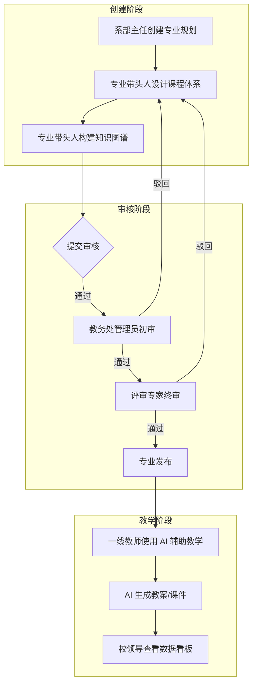
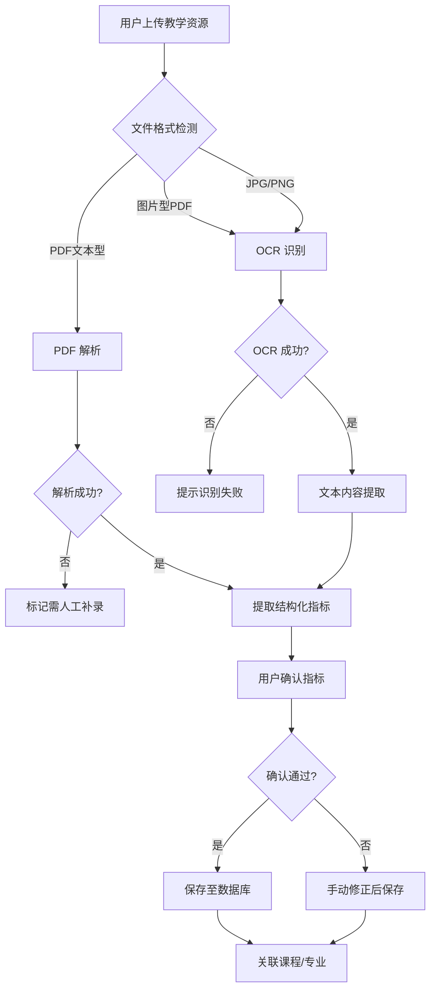
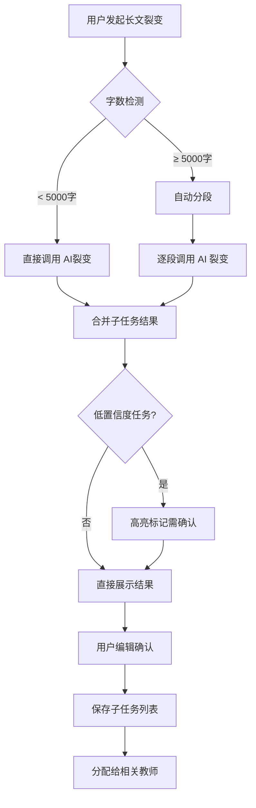
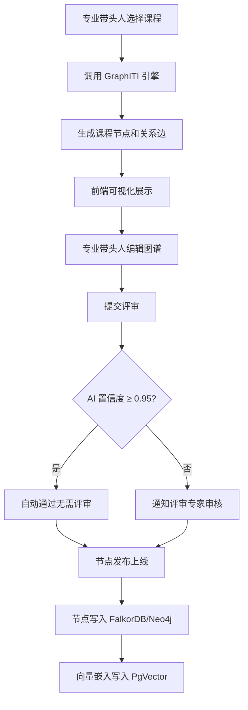
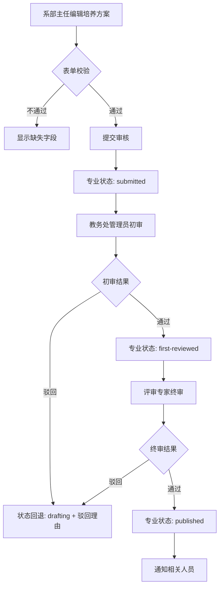
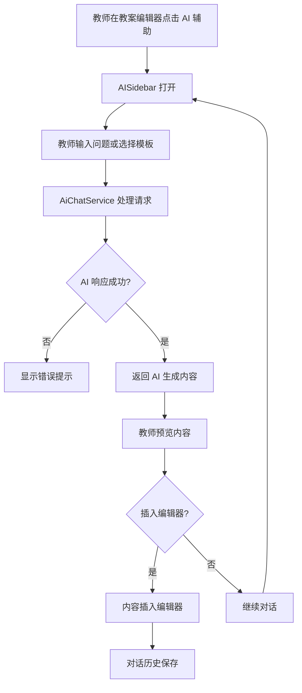
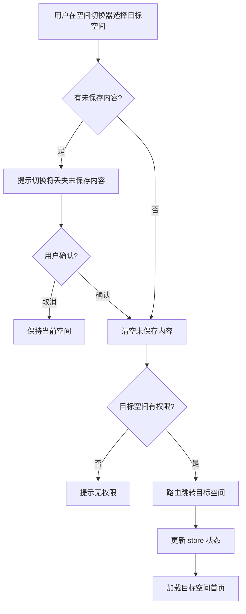
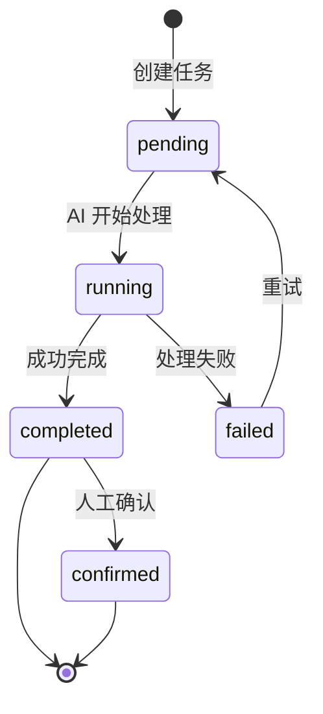
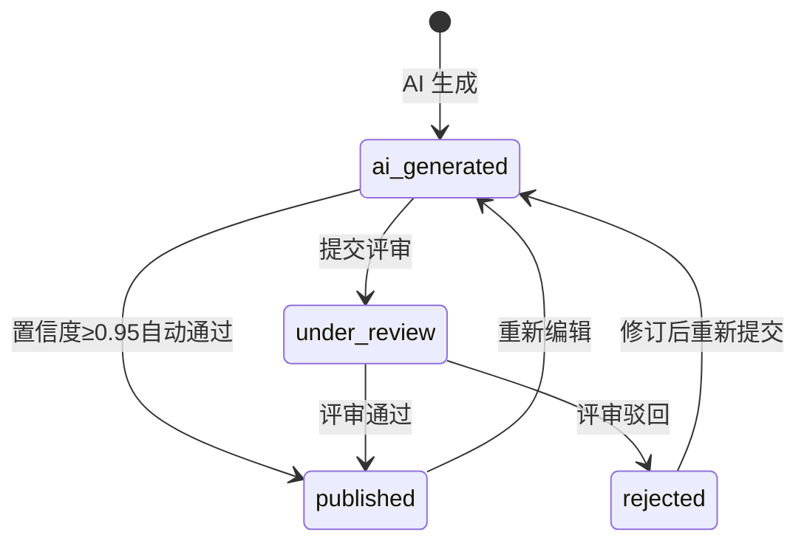

# 09-process-flows.md — Yuanzhi OS 流程图

>核心业务流程的 Mermaid 流程图与文字描述。

---

## 1. 专业建设完整流程



**说明**：专业建设从创建到发布的完整流程，包含初审/终审驳回回路。

---

## 2. 资源上传与 AI 解析流程



---

## 3. 长文裂变任务流程



---

## 4. 知识图谱构建与评审流程



---

## 5. 人才培养方案审核流程



---

## 6. AI 辅助教案编写流程



---

## 7. 空间切换流程



---

## 8. 核心状态机

### 8.1 专业方案状态机

```mermaid
stateDiagram-v2
    [*] --> drafting: 创建
    drafting --> submitted: 提交审核
    submitted --> first-reviewed: 初审通过
    submitted --> drafting: 初审驳回
    first-reviewed --> final-reviewed: 终审通过
    first-reviewed --> drafting: 终审驳回
    final-reviewed --> published: 发布
    published --> drafting: 重新编辑（需重新审核）
    published --> archived: 归档
    archived --> [*]
```

### 8.2 AI 任务状态机



### 8.3 知识图谱节点状态机



---

*流程图基于08-use-cases.md的用例推导。覆盖矩阵见10-coverage-matrix.md。*