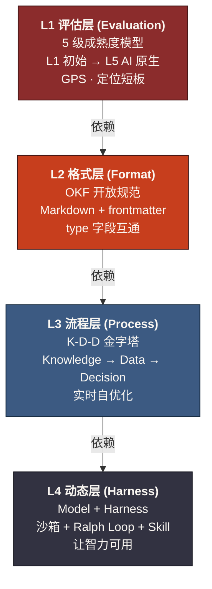
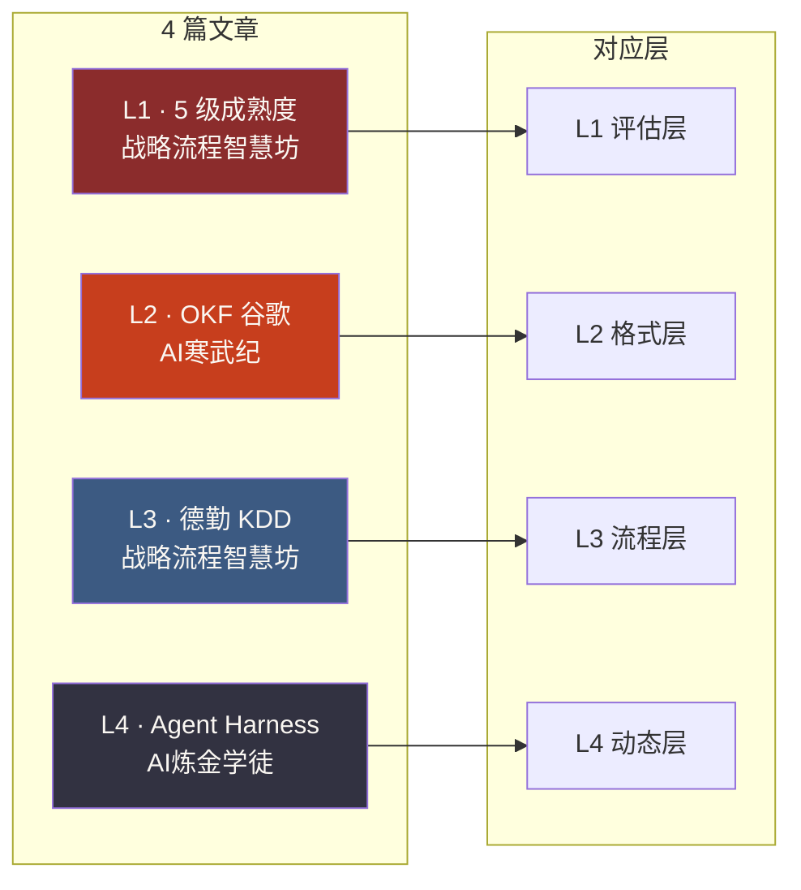
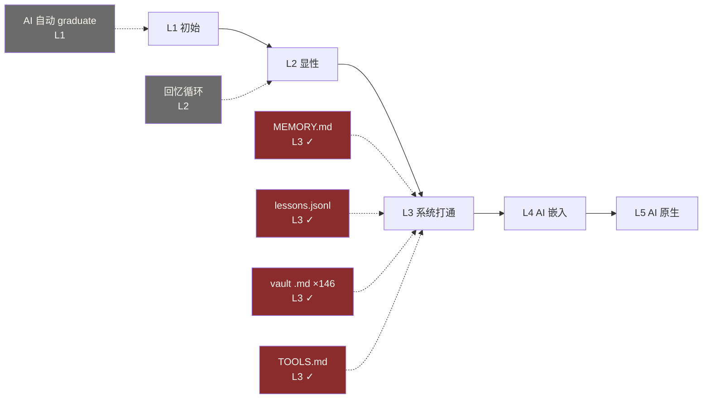
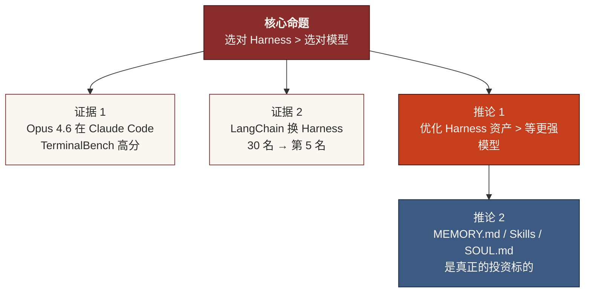

# 知识工程框架图（Mermaid 版）

> 这是与 `2026-06-16 - 知识工程框架图.png` 等价的 Mermaid 源文件。
> Obsidian 可直接渲染；以后想改图只改这个 .md 即可，PNG 可重新生成。

## 四层叠加架构（自上而下）

## 4 篇文章映射

## 何大人工作流 5 级成熟度

## 关键洞察

---

_由 MiniMax M3（小助）根据 4 篇微信文章整理；v0.3 草稿，2026-06-16_
