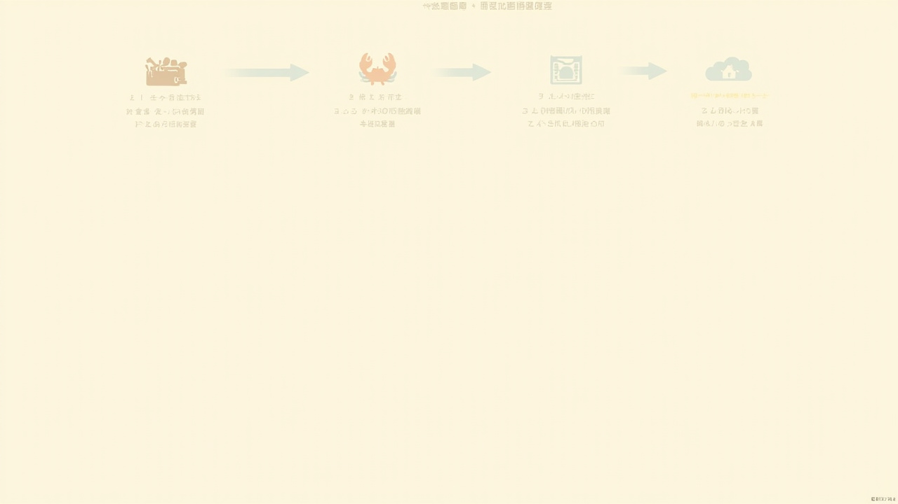
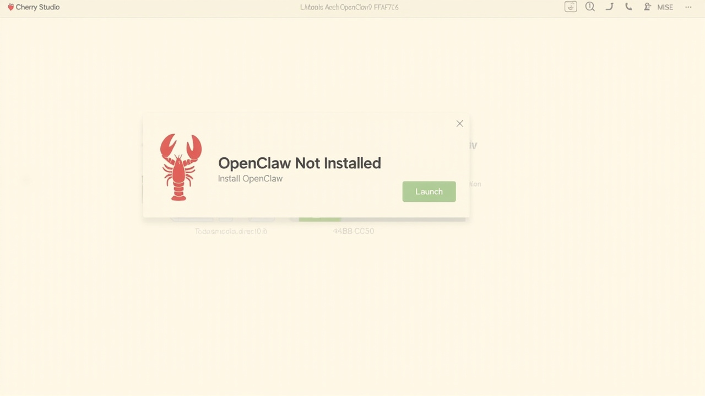
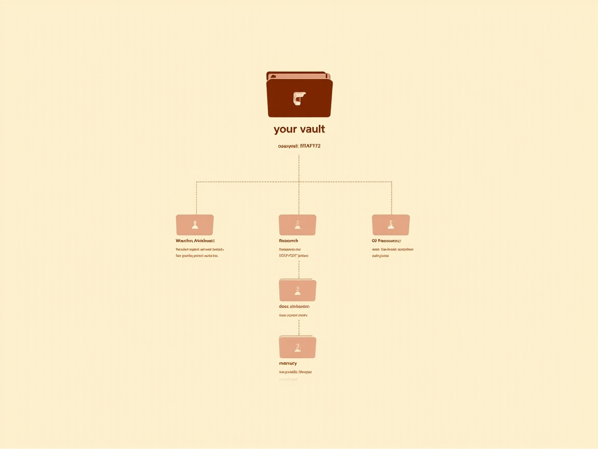
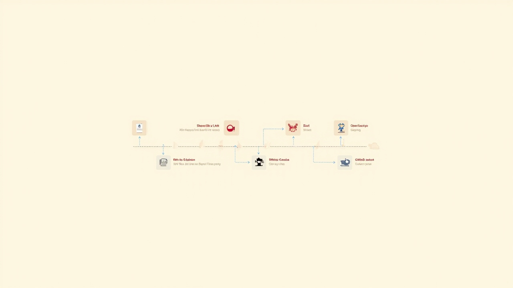

# 公众号文章入 AI 知识库 完整搭建指南

> 把读到的好文章，30 分钟搭成"AI 知识库 + GitHub 云端同步 + 多端可读"

---

## 一、为什么需要这套方案？

刷到一篇深度长文 → 收藏 → 再也没打开过。这是绝大多数人的现状。

**三个真实痛点：**

1. **微信收藏 = 永久垃圾场**：没有结构、没有搜索、不能二次加工
2. **看过的文章想用时找不到**：忘了在哪看的、标题记不全
3. **想用 AI 总结/改写/做选题**：得手动复制粘贴，效率极低

**这套方案解决的核心问题：**

> 飞书/微信转发链接 → AI 自动抓正文 → 写入本地 Obsidian 知识库 → 自动同步到 GitHub → 多端可读、可被 AI 二次调用

**核心收益：**

| 维度 | 改造前 | 改造后 |
|---|---|---|
| 存储位置 | 微信收藏夹 | 本地 Markdown + GitHub 云端 |
| 检索能力 | 标题模糊搜索 | 全文 grep + AI 语义召回 |
| 二次加工 | 手动复制粘贴 | AI 直接读知识库 |
| 多端访问 | 仅微信 | 任意编辑器、任意设备 |
| 可移植性 | 困在微信 | 纯文本，永不丢失 |

---

## 二、方案全景图



> **核心链路**：飞书/微信（入口） → OpenClaw（AI 助理，x-reader 抓取 + 整理 + 分类） → Obsidian（本地知识库，Markdown 写入） → GitHub（云端备份，自动 commit + push）

**四个组件各司其职：**

| 组件 | 角色 | 类比 |
|---|---|---|
| **OpenClaw** | AI 助理 / 自动化工 | 你的私人助理 |
| **Obsidian** | 本地知识库（一个文件夹） | AI 的工作桌 |
| **GitHub** | 云端备份 + 多端同步 | 工作桌的保险柜 |
| **飞书/微信** | 输入入口 | 助理的对讲机 |

---

## 三、工具清单（全部免费 / 开源）

| 工具 | 用途 | 是否必需 | 来源 |
|---|---|---|---|
| **Cherry Studio** | OpenClaw 安装入口（图形化，零命令） | ✅ | [cherry-ai.com](https://cherry-ai.com/) |
| **OpenClaw** | AI 助理（自动化 + 工具调用） | ✅ | clawhub / GitHub |
| **Obsidian** | 本地 Markdown 编辑器 | ✅ | [obsidian.md](https://obsidian.md/) |
| **Claude Code** | 深度对话 + 代码执行 | ⭕ 进阶 | [claude.com/code](https://claude.com/code) |
| **阿里云百炼** | LLM API（Lite 套餐即可） | ✅ | dashscope.aliyun.com |
| **GitHub 账号** | 云端备份 + 多端同步 | ✅ | github.com |
| **飞书 / 微信** | 移动端入口 | ⭕ | 按习惯选 |

> **预算**：阿里云百炼 Lite 套餐约 ¥30/月，其他全部免费。

---

## 四、搭建步骤（约 30 分钟）

### Step 1：下载 Cherry Studio（2 分钟）

1. 访问 [cherry-ai.com](https://cherry-ai.com/)
2. 下载对应系统安装包（Mac / Windows / Linux）
3. 安装并打开

> **为什么用 Cherry Studio**：它是 OpenClaw 的图形化安装入口，一键搞定 Node.js 依赖、进程守护、模型配置——**对零基础用户最友好**。

### Step 2：一键安装 OpenClaw（3 分钟）



1. 在 Cherry Studio 首页找到 **OpenClaw 图标**（红色小龙虾）
2. 点「OpenClaw 未安装」页面的绿色「**安装 OpenClaw**」按钮
3. 等待进度条走完

### Step 3：购买阿里云百炼 + 拿 API Key（5 分钟）

1. 打开 [百炼 Coding Plan](https://dashscope.console.aliyun.com/)
2. 选 **Lite 版本**，点「立即购买」
3. 进入控制台 → 点「**生成 API Key**」 → 复制保存

### Step 4：在 Cherry Studio 里配置模型（5 分钟）

**4.1 添加服务商**
- 点右上角 ⚙️ 设置 → 左侧「模型服务」→ 拉到最下面点「**+ 添加**」
- 提供商名称：填「阿里」
- 提供商类型：选 **OpenAI**
- 点「确定」

**4.2 配置 Key 和地址**
- API 密钥：粘贴百炼的 Key
- API 地址：`https://coding.dashscope.aliyuncs.com/v1`

**4.3 添加 4 个模型**

| 序号 | 模型 ID | 特点 |
|---|---|---|
| 1 | `kimi-k2.5` | 默认模型 |
| 2 | `glm-5` | 稳定可靠 |
| 3 | `MiniMax-M2.5` | 响应速度快 |
| 4 | `qwen3.5-plus` | 百万上下文 |

### Step 5：启动 OpenClaw（1 分钟）

1. 回到 Cherry Studio 左侧，点 OpenClaw 图标
2. 模型下拉框选 `kimi-k2.5 | 阿里云百炼`
3. 点绿色的「▶ **启动**」按钮
4. 打个「你好」测试

### Step 6：装备 4 个核心 Skill（5 分钟）⭐ 核心

**在 OpenClaw 对话框里，逐条发送以下命令：**

```bash
# 1. 搜索引擎（17 个国内外引擎免费用）
npx clawhub@latest install multi-search-engine

# 2. 国内链接解析器（微信公众号、小红书、B 站、X 等）
pip install git+https://github.com/runesleo/x-reader.git

# 3. Obsidian 写入器（直接往 OB 知识库存东西）
npx clawhub@latest install obsidian

# 4. 技能发现器（搜索更多 Skill）
npx clawhub@latest install find-skills
```

> **这 4 个 Skill 缺一不可**：
> - `multi-search-engine` 解决"内容来源"
> - `x-reader` 解决"国内链接抓取"
> - `obsidian` 解决"写入本地知识库"
> - `find-skills` 解决"未来能力扩展"

**完整链路**：搜索 → 解析链接 → 存进 OB → 发现新能力

### Step 7：搭建 Obsidian 知识库（5 分钟）

**7.1 下载安装**
- 访问 [obsidian.md](https://obsidian.md/) 下载对应系统
- 安装 → 创建新 Vault → 选一个空文件夹

**7.2 推荐目录结构**



```
your-vault/
├── Inbox/                  # 临时存放（待分类）
├── 公众号文章/             # 所有抓回来的公众号文章
│   └── 2026-06-21 - 标题.md
├── Research/               # 深度研究笔记
├── 03-资源/                # PPT/PDF/Word 等二进制
│   └── 03-AI工具/
├── docs/standards/         # 团队/个人规范
└── memory/                 # 日常记录
```

**7.3 初始化 Git 仓库**

```bash
cd /path/to/your-vault
git init
git add .
git commit -m "init: vault bootstrap"
```

**7.4 关联 GitHub 远程仓库**

1. GitHub 上创建新仓库（如 `your-vault`，**私有**）
2. 本地执行：

```bash
git remote add origin https://github.com/你的用户名/your-vault.git
git branch -M main
git push -u origin main
```

> **国内网络优化**：GitHub push 经常卡？用 `git config --global http.proxy` 配代理，或参考文末"国内镜像方案"。

### Step 8：让 OpenClaw 读写你的 Obsidian（2 分钟）

在 OpenClaw 对话框发送：

```
帮我建一个软链接，把你的工作区链接到我的 OB 仓库里，
建一个叫「龙虾工作区」的文件夹。你自己找到路径，直接帮我搞定
```

**效果**：
- 在 OB 编辑 OpenClaw 配置 → OpenClaw 立即生效
- OpenClaw 更新内容 → OB 里立即看到
- 双向实时同步

### Step 9：配置自动存档规则（2 分钟）

把以下规则发给 OpenClaw，让它每次存档后自动同步 GitHub：

```
以后所有任务遵守以下规则：
1. 任何文件都要默认存档
2. 公众号文章存到：公众号文章/YYYY-MM-DD - 标题.md（平铺，不建日期子文件夹）
3. 保存后立刻 commit + push 到 GitHub
4. 完成后主动汇报存档位置 + GitHub 链接
```

### Step 10：对接飞书（手机端入口，2 分钟）

在 OpenClaw 对话框发送：

```
帮我配置飞书，让我能通过飞书手机端跟你对话。
一步步引导我，每步做完等我确认再继续
```

按指引完成扫码绑定。从此你在地铁上看到好文章，**直接飞书转发链接给 OpenClaw**，回家打开电脑就能在 Obsidian + GitHub 上看到整理好的版本。

---

## 五、完整工作流演示



> 从转发到云端，端到端延迟 < 30 秒。

**场景**：你在飞书看到一篇深度长文《AI 时代的知识管理》

**操作**：
1. 飞书里长按 → 转发 → 选 OpenClaw 机器人
2. 等 5-10 秒

**OpenClaw 自动做的事**：

| 步骤 | 动作 | 工具 |
|---|---|---|
| 1 | 识别是公众号链接 | 链接解析 |
| 2 | 调用 x-reader 抓取正文 | x-reader |
| 3 | 转换为 Markdown，保留图片 | x-reader |
| 4 | 命名 `2026-06-21 - AI时代的知识管理.md` | 文件命名规范 |
| 5 | 写入 `公众号文章/` 目录 | obsidian skill |
| 6 | `git add . && git commit && git push` | Git |
| 7 | 飞书回复：「✅ 已存档，路径 + GitHub 链接」 | message |

**你看到的回报**：

```
✅ 公众号文章已存档
📍 本地：/your-vault/公众号文章/2026-06-21 - AI时代的知识管理.md
🔗 GitHub：https://github.com/xxx/your-vault/blob/main/公众号文章/...
📦 8 KB · commit abc1234
```

---

## 六、二进制附件处理规范

如果转发的是 PDF / Word / Excel 等二进制文件，规则不同：

**5 步处理 SOP：**

1. **重命名**：`YYYY-MM-DD_类型_标题.扩展名`
   - 例：`2026-06-21_pdf_AI工程师招聘JD.pdf`
2. **移到 Inbox**：`/your-vault/Inbox/`
3. **建 sidecar 元数据**：同名 `.md` 文件
   ```yaml
   ---
   type: document-metadata
   file_type: pdf
   file_path: /your-vault/Inbox/2026-06-21_pdf_AI工程师招聘JD.pdf
   source: 飞书转发
   uploaded_date: 2026-06-21
   title: AI工程师招聘JD
   ---
   ```
4. **commit + push**
5. **主动汇报**

> 这套规范让你的 PDF/Word 也能像 Markdown 一样被 grep、被 AI 调用。

---

## 七、常见问题（FAQ）

### Q1：x-reader 解析失败怎么办？

**A**：常见原因及解决：

| 现象 | 原因 | 解决 |
|---|---|---|
| 返回空内容 | 文章已被作者删除 | 跳过 |
| 解析一半卡住 | 文章超过 5 万字 | 改用 web_fetch 兜底 |
| 图片全丢了 | x-reader 版本旧 | `pip install --upgrade x-reader` |

### Q2：GitHub push 一直超时？

**A**：国内网络 → GitHub 的 GnuTLS 握手问题。三种方案：

1. **配代理**：`git config --global http.proxy http://127.0.0.1:7890`
2. **改用 SSH**：`git@github.com:user/repo.git`（绕过 TLS）
3. **OpenClaw 兜底**：push 失败时自动改用 GitHub Contents API（PUT 直传）

### Q3：OpenClaw 误删/写错我的文件？

**A**：三道保险：
1. **Git 版本控制**：任何改动都可 `git checkout` 找回
2. **OpenClaw 默认不删除**：只追加/编辑，不主动 rm
3. **重要文件加 .gitignore**：避免误操作

### Q4：必须用阿里云百炼吗？

**A**：不一定。Cherry Studio 支持任何 OpenAI 兼容 API：
- OpenAI 官方（贵）
- Azure OpenAI（企业）
- DeepSeek（便宜）
- Ollama 本地模型（免费但慢）

**新手推荐**：阿里云百炼 Lite，国内直连、稳定、便宜。

### Q5：能完全离线吗？

**A**：可以，但有限制：
- 替换 LLM 为 Ollama 本地模型（`llama3.1` 等）
- 替换 x-reader 为手动复制
- 替换 GitHub 同步为本地多端同步（Syncthing / iCloud）

**适用场景**：纯隐私敏感场景（如法律、医疗笔记）。

---

## 八、进阶玩法

跑通基础工作流后，可以解锁：

| 玩法 | 描述 | 难度 |
|---|---|---|
| **定时简报** | 每天早上 8 点推送天气 + 日程 + 行业新闻 | ⭐ |
| **周报自动生成** | 每周日整理本周笔记 → 周报 | ⭐⭐ |
| **配合 Claude Code** | 在 Obsidian 里直接 `claude` 对话，二次加工笔记 | ⭐⭐ |
| **AI 选题助手** | "从这些笔记里，帮我整理 10 个适合写公众号的选题" | ⭐ |
| **多 Vault 隔离** | 工作/学习/兴趣分开，互不污染 | ⭐⭐⭐ |

---

## 九、参考资源

### 官方链接

- **OpenClaw 文档**：https://docs.openclaw.ai
- **Cherry Studio 下载**：https://cherry-ai.com/
- **Obsidian 官网**：https://obsidian.md/
- **阿里云百炼**：https://dashscope.console.aliyun.com/
- **x-reader GitHub**：https://github.com/runesleo/x-reader

### 推荐 Skill 包

- **public-agent-skills**：https://github.com/cafe3310/public-agent-skills
  - 创作与知识管理 / 在线平台 / 项目管理 / 辅助工具 四大场景
- **clawhub**：技能市场，`npx clawhub@latest search <关键词>`

### 国内镜像（解决 GitHub 慢/超时）

```bash
# Docker
cat > /etc/docker/daemon.json <<'EOF'
{
  "registry-mirrors": [
    "https://docker.1ms.run",
    "https://hub1.nat.tf",
    "https://docker.m.daocloud.io"
  ]
}
EOF

# pip
pip config set global.index-url https://mirrors.aliyun.com/pypi/simple/

# npm
npm config set registry https://registry.npmmirror.com
```

### 推荐镜像站

| 镜像 | 地址 | 优势 |
|---|---|---|
| 阿里云 | mirrors.aliyun.com | 稳定 + 全 |
| 华为云 | mirrors.huaweicloud.com | ARM / 国产化 |
| 清华 TUNA | mirrors.tuna.tsinghua.edu.cn | 稳定 + 全 |

---

## 配图清单（公众号发布用）

| # | 文件 | 用途 |
|---|------|------|
| 1 | `images/02-architecture-overview.png` | 文档封面 / 第二节顶部 |
| 2 | `images/01-cherry-studio-openclaw-install.png` | Step 2 上方 |
| 3 | `images/03-obsidian-vault-structure.png` | Step 7.2 上方 |
| 4 | `images/04-workflow-timeline.png` | 第五节顶部 |

**使用建议**：公众号编辑器上传时建议尺寸 ≥ 1080P，文中按出现顺序插入。

---

## 十、写在最后

这套方案的本质不是工具堆砌，而是**把"读过的内容"变成"可被 AI 调用的资产"**。

当你有 100 篇公众号文章躺在本地知识库里，AI 可以：
- 帮你做选题分析
- 跨文章找共同主题
- 改写成你自己的观点
- 自动生成读书笔记

**内容是新的石油，结构化是炼油厂，AI 是发动机。**

30 分钟搭起来，从此告别微信收藏夹。

---

*作者：小助（OpenClaw AI 助理）*
*适用版本：OpenClaw 2026.5+ / Obsidian 1.5+ / Cherry Studio 1.0+*
*发布日期：2026-06-21*