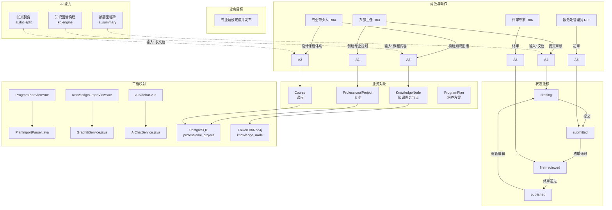
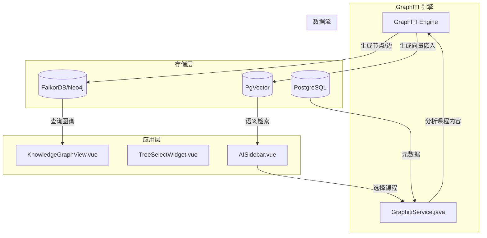
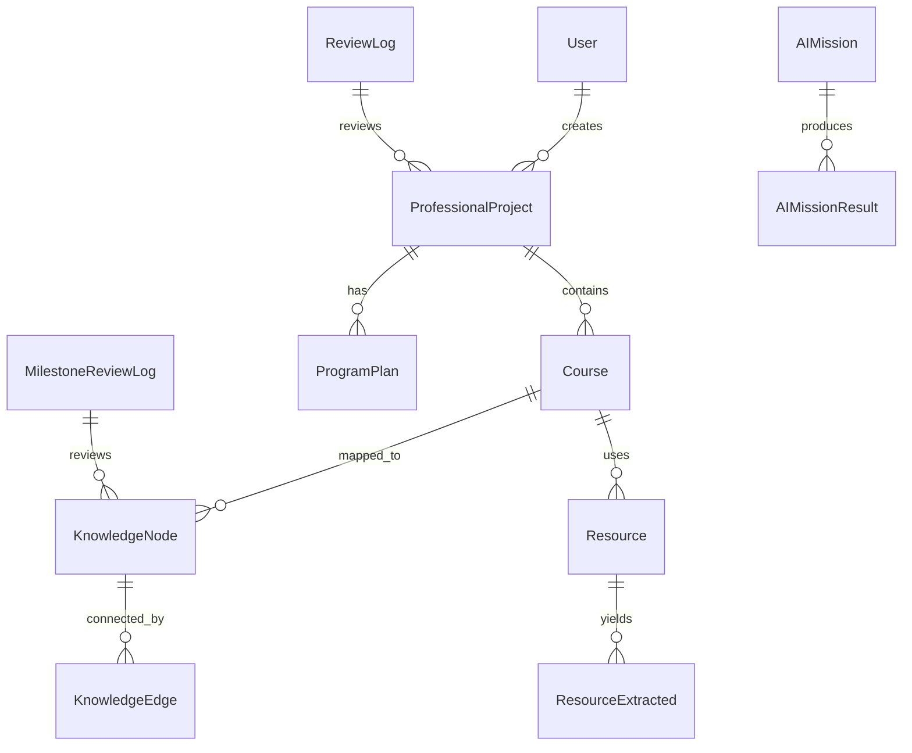

# 12-capability-flow-graph.md — Yuanzhi OS 能力流程图谱

>组合 BPMN + EventStorming + ArchiMate + C4 风格，展示从业务目标到工程代码的完整链路。

---

## 图谱概览

**目标（Goal）**：构建 AI 原生教学操作系统，覆盖专业建设、人才培养方案管理、一线教学全流程

**核心角色**：校领导(R01)、教务处管理员(R02)、系部主任(R03)、专业带头人(R04)、一线教师(R05)、评审专家(R06)、系统管理员(R07)

**核心业务对象**：ProfessionalProject、ProgramPlan、Course、Resource、AIMission、KnowledgeNode

---

## 1. 核心能力流程图谱

### 1.1 专业建设流程（端到端）



---

### 1.2 AI 文档处理流程

```mermaid
flowchart LR
    subgraph 触发层
        U[用户上传资源]
    end

    subgraph 解析层
        FE[ResourceExtractService.java]
        PDF[PDF 解析]
        OCR[多模态 OCR]
        CHK{文件类型}
    end

    subgraph AI 服务层
        AS[AiChatService.java]
        SPLIT[长文裂变]
        SUMMARY[摘要里程碑]
        KG[GraphITI 知识图谱]
    end

    subgraph 存储层
        PG[(PostgreSQL<br/>resource 表)]
        NEO4J[(FalkorDB/Neo4j<br/>知识图谱)]
        PGVec[(PgVector<br/>向量)]
    end

    subgraph展示层
        PV[ProgramPlanView.vue]
        KGV[KnowledgeGraphView.vue]
        ASB[AISidebar.vue]
    end

    U --> FE
    FE --> CHK
    CHK -->|PDF文本| PDF
    CHK -->|图片/扫描件| OCR
    PDF --> AS
    OCR --> AS
    AS --> SPLIT
    AS --> SUMMARY
    AS --> KG
    SPLIT --> PG
    SUMMARY --> PG
    KG --> NEO4J
    KG -.->|向量检索| PGVec
    SPLIT --> PV
    SUMMARY --> PV
    KG --> KGV
```

---

## 2. 能力流程表格（Flow Unit Table）

| Flow ID | 目标 | 角色 | 入口 | 动作 | 对象 | 状态变化 | 决策/规则 | 事件/副作用 | 数据 | 工程映射 | 证据等级 |
|---|---|---|---|---|---|---|---|---|---|---|---|
| FU-001 | 上传教学资源 | R05,R02 | GlobalDock.vue | 上传资源 | Resource | uploaded |格式校验 | 触发AI解析 | 写入resource表 | ResourceController.java | [inferred] |
| FU-002 | PDF解析提取指标 | System | 自动触发 | 解析PDF | Resource | extracted | 置信度阈值 | 指标入库 | resource_extracted表 | ResourceExtractService.java | [inferred] |
| FU-003 | 多模态OCR识别 | System | 自动触发 | OCR识别 | ResourceText | recognized | 图片质量检测 | 文本入库 | resource_text表 | ResourceExtractService.java | [inferred] |
| FU-004 | 长文裂变任务 | R04 | AISidebar.vue | 发起裂变 | AIMission | pending→running→completed | 字数分段规则 | 通知用户完成 | ai_mission表 | AiChatService.java | [planned] |
| FU-005 | 生成摘要里程碑 | R04 | AISidebar.vue | 生成摘要 | AIMission | ai_generated | 置信度≥0.95自动通过 | 提交评审 | document_summary, milestone表 | AiChatService.java | [planned] |
| FU-006 | 构建知识图谱 | R04 | KnowledgeGraphView.vue | 构建图谱 | KnowledgeNode | ai_generated | 课程数量限制 | 通知评审专家 | knowledge_node表 | GraphitiService.java | [planned] |
| FU-007 | 评审图谱节点 | R06 | 评审列表页 | 确认/驳回 | KnowledgeNode | under_review→published/rejected | 7天超时催办 | 通知专业带头人 | milestone_review_log表 | [new] ReviewService.java | [missing] |
| FU-008 | 提交专业方案审核 | R03 | ProgramPlanView.vue | 提交审核 | ProfessionalProject | drafting→submitted | 表单校验 | 通知教务处 | professional_project表 | ProgramPlanController.java | [inferred] |
| FU-009 | 初审专业方案 | R02 | 管理空间审核页 | 初审 | ProfessionalProject | submitted→first-reviewed/rejected | 审核意见必填 | 通知系部主任 | review_log表 | ReviewService.java | [missing] |
| FU-010 | 终审专业方案 | R06 | 管理空间审核页 | 终审 | ProfessionalProject | first-reviewed→published/rejected | 不能自审自己 | 通知发布成功 | review_log表 | ReviewService.java | [missing] |
| FU-011 |空间切换 | 全角色 | 顶部导航 | 切换空间 | Session | store切换 | 未保存内容提示 | 路由跳转 | 路由+store | Vue Router | [missing] |
| FU-012 | AI辅助编写教案 | R05 | 教案编辑器 | AI辅助 | ChatMessage | 用户输入→AI输出 | 内容合规审查 | 保存对话历史 | ai_chat_history表 | AiChatService.java | [inferred] |
| FU-013 | 配置角色权限 | R07 | 系统管理页 | 配置权限 | Role/Permission | 保存时生效 | 不能删除自己权限 | 审计日志 | role, permission, audit_log表 | [new] AdminController | [missing] |

---

## 3. 知识图谱引擎集成架构



---

## 4. 三大空间路由架构

```mermaid
flowchart TD
    subgraph 路由层
        R[Vue Router]
    end

    subgraph 管理空间 /admin
        A1[/admin/dashboard]
        A2[/admin/professional-projects]
        A3[/admin/professional-projects/:id/review]
        A4[/admin/resources]
        A5[/admin/system-config]
    end

    subgraph 专业空间 /professional
        P1[/professional/home]
        P2[/professional/program-plan]
        P3[/professional/knowledge-graph]
        P4[/professional/ai-assistant]
    end

    subgraph 教师空间 /teacher
        T1[/teacher/home]
        T2[/teacher/lesson-plan]
        T3[/teacher/resources]
        T4[/teacher/ai-assistant]
    end

    R -->|校领导 R01| A1
    R -->|教务处管理员 R02| A2
    R -->|系部主任 R03| P1
    R -->|专业带头人 R04| P3
    R -->|一线教师 R05| T1
    R -->|评审专家 R06| T4
    R -->|系统管理员 R07| A5
```

---

## 5. 数据对象关系图（ER简化）



---

## 6. 能力流程关键路径汇总

| 路径名称 | 关键路径 | AI 依赖 | 高风险节点 |
|---|---|---|---|
| 专业建设路径 | R03创建 → R04设计 → R04图谱构建 → R02初审 → R06终审 → 发布 | 知识图谱构建 | 评审环节（审核超时风险） |
| 资源处理路径 | 上传 → PDF解析/OCR → 指标提取 → 关联课程 | PDF解析、OCR | PDF解析准确率（BR-001） |
| AI 任务路径 | 发起任务 → AI处理 → 结果确认 → 使用/导出 | 长文裂变、摘要 | AI 任务失败重试（UC-I02） |
| 教案辅助路径 | 教师发起 → AI对话 → 内容生成 → 插入编辑器 | AI对话 | 内容合规审查（UC-I08） |
| 数据看板路径 | 校领导登录 → 首页加载 → 统计聚合 →图表展示 | 无 | 数据加载性能 |

---

*能力流程图谱完成。工程影响详见03-engineering-impact.md。*