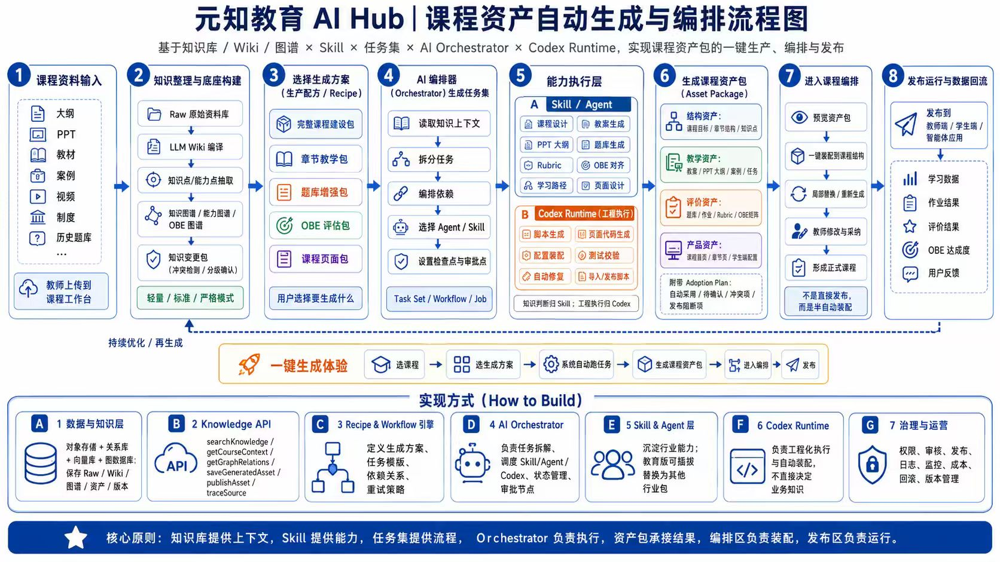

## 内容概述

这是"元知教育 AI Hub"的**课程资产自动生成与编排系统**的完整流程图，包含三层结构：

## 顶层：8 步业务流程

| 步骤 | 名称 | 说明 |
|------|------|------|
| 1 | 课程资料输入 | 接收大纲、PPT、教材、视频等原始素材 |
| 2 | 知识整理 | 通过 LLM 抽取知识，构建知识图谱 |
| 3 | 选择方案 | 用户选择生成目标（完整包/题库包等） |
| 4 | AI 编排器 | 任务拆解，分配给不同 Agent/技能 |
| 5 | 能力执行层 | A技能层（文案）+ B工程层（代码） |
| 6 | 生成课程资产包 | 结构资产 + 教学资产 + 评价资产 + 产品资产 |
| 7 | 课程编排 | 人机协作，教师预览/微调/确认 |
| 8 | 发布运行与反馈 | 发布到终端，收集学习数据形成闭环 |

## 中层：一键生成体验

简化版逻辑视图：选课程 → AI 编排 → 自动生成 → 发布

## 底层：7 大技术支柱（A-G）

- **A**: 数据层
- **B**: 知识 API
- **C**: 引擎层
- **D**: 编排器
- **E**: Agent 层
- **F**: 执行环境（Codex Runtime）
- **G**: 治理与运营系统

## 核心原则

- 知识库提供上下文
- AI 提供能力
- 任务集驱动流程