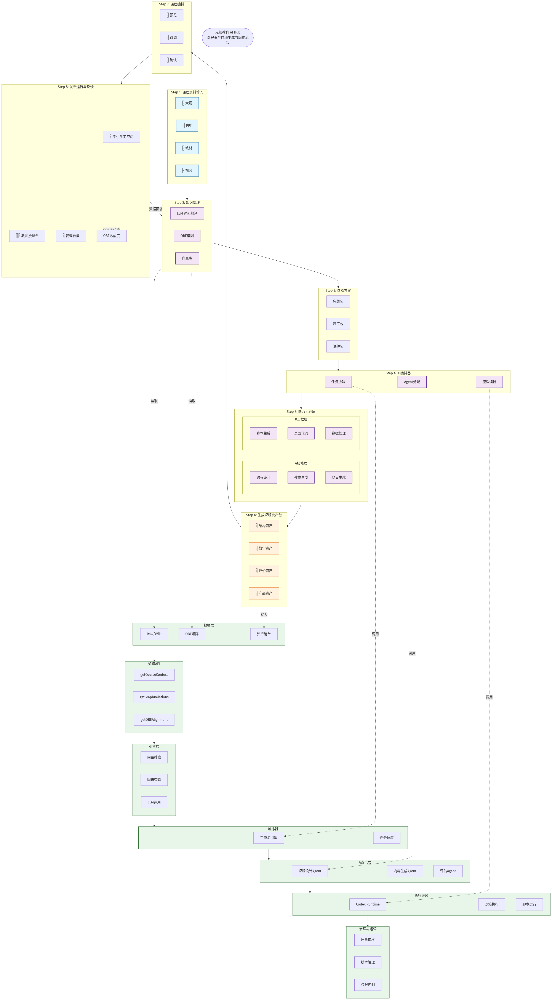

## 生成方式

本图使用 `diagram-generator` skill 生成：

1. AI 分析原图，生成 Mermaid 代码
2. 通过 [Kroki.io](https://kroki.io) API 渲染为 PNG

## Mermaid 源文件

`yuanzhi-education-workflow-2026-06-13.mmd`

## 渲染命令

```bash
# 方式1: 使用 Kroki.io API
curl -X POST "https://kroki.io/mermaid/png" \
  -H "Content-Type: text/plain" \
  --data-binary @diagram.mmd \
  -o diagram.png

# 方式2: 使用 mermaid-cli
mmdc -i diagram.mmd -o diagram.png -w 2553 -H 4624

# 方式3: 使用 npx (需 puppeteer)
npx -p mermaid mermaid -i diagram.mmd -o diagram.png
```

## 生成效果

