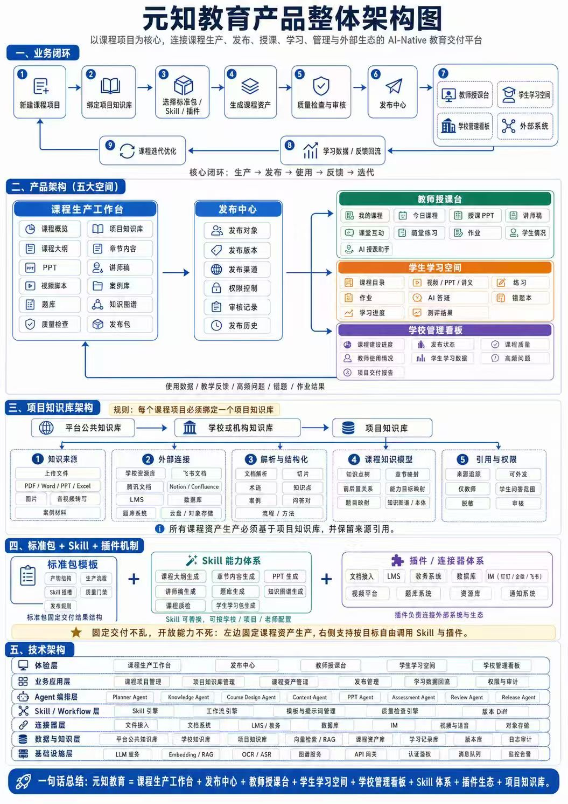

## 平台概述

**渊智教育**（Yuanzhi Education）是一个以课程项目为中心的 AI-Native 教育交付平台。

## 核心闭环

```
生产 → 分发 → 教学/学习 → 反馈驱动迭代
```

## 五大空间

| 空间 | 说明 |
|------|------|
| Production（生产空间） | 课程内容生产 |
| Distribution（分发空间） | 课程分发与交付 |
| Teaching（教学空间） | 教师端教学支持 |
| Learning（学习空间） | 学习者端学习体验 |
| Management（管理空间） | 系统管理与运营 |

## 技术架构

- **灵活机制**："标准包 + 技能 + 插件"（Standard Package + Skill + Plugin）
- **项目知识库**：沉淀项目级知识资产
- **AI 技术栈**：LLMs、Agents、RAG
- **自动化能力**：课程生成与管理自动化

## 特点

- AI 原生设计，AI 深度融入各环节
- 五大空间协同，形成完整闭环
- 标准化的扩展机制，支持技能和插件插拔式集成