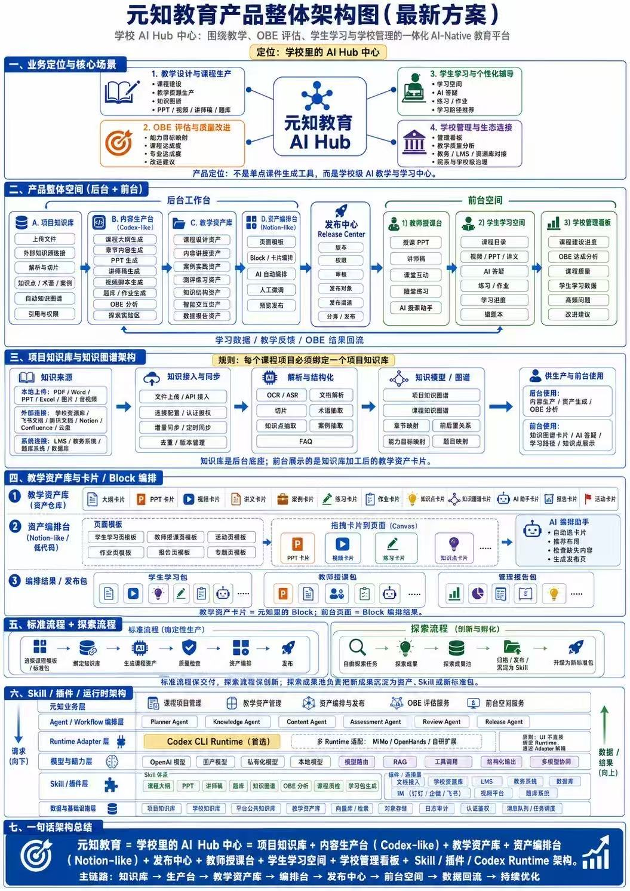

## 业务定位

定位为 **AI-Native 教育平台**，覆盖四大场景：
- 教学设计
- OBE（Outcome-Based Education）评估
- 个性化辅导
- 学校管理

## 核心架构

### 后台工作台

| 组件 | 功能 |
|------|------|
| 项目知识库 | 知识沉淀与管理 |
| Codex-like 内容生产台 | AI 驱动的内容生成 |
| 教学资产库 | 教学资源存储与管理 |
| Notion-like 资产编排台 | 灵活的内容编排与组织 |
| 发布中心 | 课程/资源的发布与分发 |

### 前台空间

- **教师授课台** — 授课支持
- **学生学习空间** — 个性化学习体验
- **学校管理看板** — 数据可视化与决策支持

## 技术底层

### 知识谱系
- **OCR/ASR** — 多源知识（文档、音频等）解析
- **大模型** — 结构化建模

### 技术栈
- **Agent / Workflow 编排层** — 复杂任务编排
- **Codex CLI 运行时** — 代码与内容生成执行环境
- **多模型驱动** — RAG 检索增强 + 工具调用

### Skill / 插件系统
支持教育专项技能：
- 课程大纲生成
- PPT 生成
- 课件生成
- ……（可扩展）

## 闭环逻辑

```
知识库 → 生产台 → 资产库 → 编排台 → 发布 → 前台
  ↑                                          ↓
  └──────────── 数据回流 ←───────────────────┘
```

配合数据回流，实现教学质量的持续优化。

## 与上一版的区别

这张图是更完整的产品体系图（vs 之前简化的五空间架构），亮点在于：
1. **双生产台设计**：Codex-like + Notion-like，分工明确
2. **OBE 评估集成**：结果导向教育评估体系
3. **三前台协同**：教、学、管一体化
4. **数据回流机制**：形成真正的迭代优化闭环